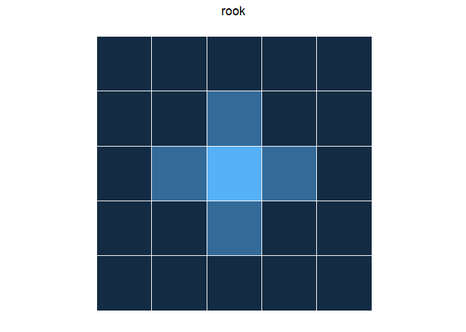
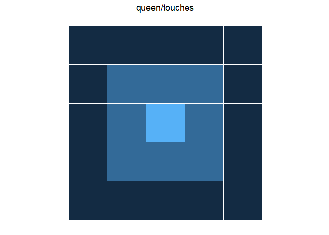
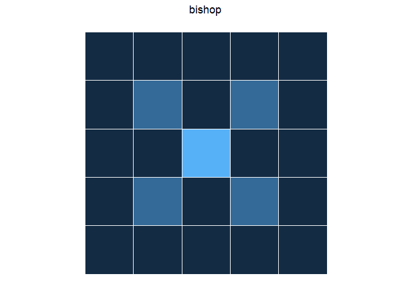
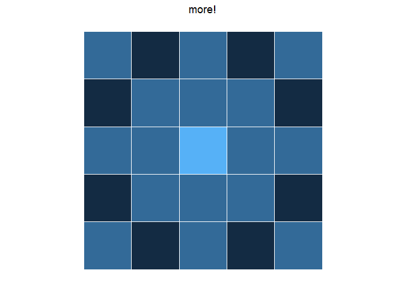
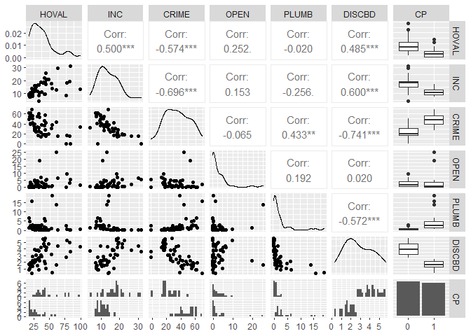

\newpage


# Introduction to Areal Data  

Areal data is spatial data which is observed or reported for spatial units which are polygons with defined borders. Some examples are country level data, state level data, county level data, or zip code level data where the data is aggregated for the defined area. This is often the case for private information (e.g. mean income in a zip code instead of income of each individual with their address), or data the is collected at that scale (e.g. proportion of democratic voters in an electoral unit; Bivand et al., 2013).  

Some of the common problems we have with areal data have to do with the selected boundary. For example, gerrymandering is a common issue with votes because changing the boundaries yields different election results. Another issue is that the choice of boundaries is often not made for the specific question being asked in the model. Bivand et al., 2013 gives the example of zip codes which are a common unit for demographic data to be reported in, but were designed for postal delivery not demographic data collection. The boundaries not fitting the underlying patterns in the data can cause model misspecification, spatial autocorrelation, and make it difficult to ascertain the number of independent observations in a dataset. Therefore, it is important to check for spatial patterning due to this partitioning to see if the model indicated is appropriate (Bivand et al., 2013).  

## Neighbors and weights  

Because we do not have a continuous surface on which to calculate distance between points to build a variogram we must consider neighbors instead. There are many ways to describe neighbors. Here are a few examples where we considering the neighbors $j$ of the center polygon $i$ where $i$ and $j$ are $1\dots n_{polygons}$, and the polygons $j$ and colored based on if we consider them to be neighbors or not.



Using these neighbor relationships we can create a `weights matrix` based on understanding what the expected relationships are between neighbors. The most simple example of this is where the $w_{ij}$ = 0 if the polygons are not neighbors and $w_{ij}$ = 1 if polygons are neighbors. 

After we do our analysis we also need to check the residuals to ensure we removed the spatial patterns.  

# Our dataset  
The **Columbus OH spatial analysis data set** we are using is published in `spData` package and comes from: _Anselin, Luc. 1988. Spatial econometrics: methods and models. Dordrecht: Kluwer Academic, Table 12.1 p. 189._

```r
## load dataset
columbus <- vect(system.file("shapes/columbus.shp", package="spData")[1])
df.columbus <- as.data.frame(columbus)
```

The county data is:  

* $\texttt{HOVAL}_i$ housing value (in \$1,000) of the location $i=1\dots49$
* $\texttt{INC}_i$ household income (in \$1,000) of the location $i=1\dots49$
* $\texttt{CRIME}_i$ residential burglaries and vehicle thefts per thousand households in the neighborhood of the location $i=1\dots49$
* $\texttt{OPEN}_i$ open space in neighborhood of the location $i=1\dots49$
* $\texttt{PLUMB}_i$ percentage housing units without plumbing of the location $i=1\dots49$
* $\texttt{CP}_i$ core-periphery is an indicator variable $I_{CP}(i)= \begin{cases}1 & \text { if the location } i \text { is in the core } \\ 0 & \text { otherwise }\end{cases}$


Because we plan to use housing value as our response variable, a logarithm transformation is applied to fix the skewness of the distribution for the variable housing value.  

```r
# Make histogram
hist(log(df.columbus$HOVAL), 
     main = "Housing value", 
     xlab = "Value  in $1000 (log)")
```

<!-- -->

# Exploratory Data Analysis  

## Measures of spatial association  

### Neighbors  
There are a many options when making the adjacency matrix as outlined above, but for our purposes we are saying that any counties touching each other are neighbors (1s) and any that aren't are not (0s). This is the neighbor schema shown in the queen/touches plot above.    

Figure out what the neighbors are, we must decide a few rule. Here we are considering all counties $i=1\dots49$ and $j=1\dots49$ that touch each other to be neighbors and that the relationship is symmetrical (i.e. $w_{ij}$ = $w_{ji}$)   


```r
xy <- terra::centroids(columbus)
neighbors <- adjacent(columbus, type = "touches", symmetrical=TRUE)
colnames(neighbors) <- c("i", "j")
# head(neighbors)
plot(columbus, col='lightgray', border='black', lwd=1)
p1 <- xy[neighbors[,1], ]
p2 <- xy[neighbors[,2], ]
lines(p1, p2, col='red', lwd=2)
```

<!-- -->


In the weight matrix any counties touching each other are neighbors and assigned a weight of 1 ($w_{ij}$ = 1) and any that are not touching each other are assigned a weight of 0 ($w_{ij}$ = 0).  

Here is what part of the adjacency matrix looks like:    

```r
adjacent(columbus, "touches", pairs = FALSE)[1:10,1:10]
```

```
##    1 2 3 4 5 6 7 8 9 10
## 1  0 1 1 0 0 0 0 0 0  0
## 2  1 0 1 1 0 0 0 0 0  0
## 3  1 1 0 1 1 0 0 0 0  0
## 4  0 1 1 0 1 0 0 1 0  0
## 5  0 0 1 1 0 1 0 1 1  0
## 6  0 0 0 0 1 0 0 0 1  0
## 7  0 0 0 0 0 0 0 1 0  0
## 8  0 0 0 1 1 0 1 0 0  0
## 9  0 0 0 0 1 1 0 0 0  1
## 10 0 0 0 0 0 0 0 0 1  0
```
From that we can understand that county$_{i=1}$ is touching counties$_{j = 2, 3}$ and not touching counties$_{j=4\dots10}$, because the weights of $w_{1,2}, w_{1,3}$ = 1 and $w_{1,4\dots10}$ = 0.

### Moran's I  

Moran's $I$ is a global measure of spatial autocorrelation with values ranging -1 to 1. Here we are using a neighbor's matrix for any counties that are touching each other ($w_{ij}$). $n$ is the number of neighborhoods in Columbus, OH which are indexed by $i$ and $j$ (is polygon $i$ a neighbor with $j$. $\overline{y}$ is the mean value of the variable of interest and $y_{1...n}$ is that value in each polygon.    

The assumptions for this test are (Bivand et al., 2013):  

* "the mean model of the data removes systematic spatial patterning from the data"   
* the observed spatial autocorrelation is not due to an underlying process in our model (i.e. a parameter controlled for in the model)  
* the chosen weights matrix suits the underlying interactions between the polygons

The main limitation of this method is that the model variance can be misspecified because it does not meet one of the assumptions above, e.g. the chosen weights matrix needs to suit the underlying interactions between the polygons. 


$$
I=\frac{n}{\sum_{i=1}^{n} \sum_{j=1}^{n} w_{ij}} \frac{\sum_{i=1}^{n} \sum_{j=1}^{n} w_{ij} (y_{i}-\overline{y}) (y_{j}-\overline{y})}{\sum_{i=1}^{n} (y_{i}-\overline{y})^{2}}
$$
Using the `terra` package to test for spatial autocorrelation of each variable, by county in Columbus, OH. 

The adjacency matrix for all counties that touch each other ($w_{ij}$ above):  

```r
ww <-  adjacent(columbus, "touches", pairs=FALSE)
```

Roughly the expected value for Moran's I is $E(I)=\frac{-1}{n-1}$   

```r
(ev = -1/(nrow(columbus)-1))
```

```
## [1] -0.02083333
```

The null hypothesis $H_0$ is that the values are distributed following a random process or with negative spatial autocorrelation (I <= -0.021), and the alternative hypothesis $H_1$ is that the values are distributed with positive spatial autocorrelation (I > -0.021). We are using a significance level of $\alpha = 0.05$. Negative spatial autocorrelation is a phenomena that generally occurs in random dataset. Positive spatial autocorrelation indicates neighbors are more similar to each other than non-neighbors.  The p-value is calculated using a Monte Carlo simulation, from which we derive a density plot of the I values from each permutation and calculate the number of times our simulated I value is greater than or equal to the observed value out of all the trials. A monte carlo simulation is the best method for this because it is robust to irregularly shaped polygons.  

#### House value  

```r
## Moran's I
(ac <- autocor(columbus$HOVAL, ww, "moran"))
```

```
## [1] 0.2213441
```

```r
## Monte Carlo sim to test for significance 
m <- sapply(1:99, function(i) {
    autocor(sample(columbus$HOVAL), ww, "moran")
})
plot(density(m), main = NA); abline(v=ac, col = "red", lwd = 2) #distribution of values of I using subsets of dataset
```


```r
## p-value
sum(m >= ac) / 100 # number of times I of subset is >= to I of entire dataset / number of trials
```

```
## [1] 0.01
```

So there is significant (Moran's I = 0.2213441, p < 0.05) spatial autocorrelation in house value, meaning the average value of houses in neighboring neighborhoods are different from the average value of all neighborhoods.

#### Household income  

```r
## Moran's I
(ac <- autocor(columbus$INC, ww, "moran"))
```

```
## [1] 0.412344
```

```r
## sim
m <- sapply(1:99, function(i) {
    autocor(sample(columbus$INC), ww, "moran")
})


## p-value
sum(m >= ac) / 100
```

```
## [1] 0
```

There is significant positive (Moran's I = 0.412344, p < 0.05) Spatial autocorrelation in household income.   

#### Crime  

```r
## Moran's I
(ac <- autocor(columbus$CRIME, ww, "moran"))
```

```
## [1] 0.5154614
```

```r
##sim
m <- sapply(1:99, function(i) {
    autocor(sample(columbus$CRIME), ww, "moran")
})

## p-value
sum(m >= ac) / 100
```

```
## [1] 0
```

So again we see significant spatial autocorrelation (Moran's I = 0.5154614, p < 0.05).  

#### Open space  

```r
## Moran's I
(ac <- autocor(columbus$OPEN, ww, "moran"))
```

```
## [1] -0.03669849
```

```r
## sim
m <- sapply(1:99, function(i) {
    autocor(sample(columbus$HOVAL), ww, "moran")
})

## p-value
sum(m >= ac) / 100
```

```
## [1] 0.57
```


There is not spatial autocorrelation with open space (Moran's I = -0.0366985; p-value > 0.05)

#### Plumbing  

```r
## Moran's I
(ac <- autocor(columbus$PLUMB, ww, "moran"))
```

```
## [1] 0.4550575
```

```r
## sim
m <- sapply(1:99, function(i) {
    autocor(sample(columbus$HOVAL), ww, "moran")
})

## p-value
sum(m >= ac) / 100
```

```
## [1] 0
```


There is significant spatial autocorrelation with plumbing (Moran's I = 0.4550575, p < 0.05).

### Geary's C  

Geary's $C$ is a measure of global measure of spatial autocorrelation that is more sensitive to local correlations. It is roughly inversely related to Moran's I. The values ranging 0 to greater than 1, with values 0-1 representing positive spatial autocorrelation and values > 1 representing negative spatial autocorrelation. 

The neighbor's matrix ($w_{ij}$) is the same what was used for Moran's I. $N$ is the number of spatial units indexed by i and j; $y$ is the variable of interest; $\bar{y}$ is the mean of $y$; $w_{ij}$ is a matrix of spatial weights with zeroes on the diagonal (i.e., $w_{ii}=0$); and $W$ is the sum of all $w_{ij}$.  $\sum_{i \neq j} w_{i j}$ is the sum of that weight matrix with the diagonal equal to 0.  
$$
C=\frac{(n-1) \sum_{i} \sum_{j} w_{i j}\left(y_{i}-y_{j}\right)^{2}}{2\left(\sum_{i \neq j} w_{i j}\right) \sum_{i}\left(y_{i}-\bar{y}\right)^{2}}
$$

The null hypothesis here is that the values are distributed following a random process or have negative spatial autocorrelation (C >= 1), and the alternative hypothesis is that the values are distributed with positive spatial autocorrelation (C < 1). The p-value is calculated using a Monte Carlo simulation, from which we derive a density plot of the C values from each permutation and calculate the number of times our simulated C value is greater than or equal to the observed value out of all the trials. A monte carlo simulation is the best method for this because it is robust to irregularly shaped polygons.  

#### House Value

```r
(gearyc <- autocor(columbus$HOVAL, ww, "geary"))
```

```
## [1] 0.7889937
```

```r
## Monte Carlo sim to test for significance 
m <- sapply(1:99, function(i) {
    autocor(sample(columbus$HOVAL), ww, "geary")
})
plot(density(m), main = NA); abline(v=gearyc, col = "red", lwd = 2)
```


```r
## p-value
sum(m <= gearyc) / 100
```

```
## [1] 0.06
```

No significant spatial autocorrelation (geary's c = 0.7889937, p > 0.05).  

#### Household Income  

```r
(gearyc <- autocor(columbus$INC, ww, "geary"))
```

```
## [1] 0.7137603
```

```r
## Monte Carlo sim to test for significance 
m <- sapply(1:99, function(i) {
    autocor(sample(columbus$INC), ww, "geary")
})

## p-value
sum(m <= gearyc) / 100
```

```
## [1] 0.01
```

Significant spatial autocorrelation (geary's c = 0.7137603, p < 0.05).  

#### Crime  

```r
(gearyc <- autocor(columbus$CRIME, ww, "geary"))
```

```
## [1] 0.5916113
```

```r
## Monte Carlo sim to test for significance 
m <- sapply(1:99, function(i) {
    autocor(sample(columbus$CRIME), ww, "geary")
})

## p-value
sum(m <= gearyc) / 100
```

```
## [1] 0
```

Significant spatial autocorrelation (geary's c = 0.5916113, p < 0.05).  

#### Open space  

```r
(gearyc <- autocor(columbus$OPEN, ww, "geary"))
```

```
## [1] 0.878182
```

```r
## Monte Carlo sim to test for significance 
m <- sapply(1:99, function(i) {
    autocor(sample(columbus$OPEN), ww, "geary")
})

## p-value
sum(m <= gearyc) / 100
```

```
## [1] 0.38
```

No significant spatial autocorrelation (geary's c = 0.878182, p > 0.05).  

#### Plumbing  

```r
(gearyc <- autocor(columbus$PLUMB, ww, "geary"))
```

```
## [1] 0.6806864
```

```r
## Monte Carlo sim to test for significance 
m <- sapply(1:99, function(i) {
    autocor(sample(columbus$PLUMB), ww, "geary")
})

## p-value
sum(m <= gearyc) / 100
```

```
## [1] 0.04
```

Significant spatial autocorrelation (geary's c = 0.6806864, p < 0.05).  

### Compare Moran's I and Geary's C  
Reinhard Furrer [@Furrer] suggests to take 1-C to compare it to Moran's I more easily.  

```r
m <- data.frame(Morans_I = mi,
                signif = mi.p,
                Gearys_C = gc,
                One_minus_Gearys_C = 1-gc,
                signif = gc.p,
                row.names = c("House value", "Income", "Crime", "Open space", "Plumbing"))
# m
knitr::kable(m, digits = 3)
```


|            | Morans_I|signif | Gearys_C| One_minus_Gearys_C|signif.1 |
|:-----------|--------:|:------|--------:|------------------:|:--------|
|House value |    0.221|*      |    0.789|              0.211|         |
|Income      |    0.412|*      |    0.714|              0.286|*        |
|Crime       |    0.515|*      |    0.592|              0.408|*        |
|Open space  |   -0.037|       |    0.878|              0.122|         |
|Plumbing    |    0.455|*      |    0.681|              0.319|*        |

There are differences observed in spatial autocorrelation in the data calculated with Moran's I and Geary's C. For both Moran's I and Geary's C there was not significant spatial autocorrelation in Open space. There was significant positive spatial autocorrelation in household income, crime, and plumbing using Moran's I and Geary's C. Housing value only had positive spatial autocorrelation using Moran's I. However the trends are the same (both find weak to moderate positive spatial correlation)  

# Spatial regression models


To build our intuition, we model our response variable `HOVAL` (home value in 1000s of dollars) starting with a simple means model and expanding on it with a regression model with uncorrelated errors. After that we address the shortcomings of these simplistic models by incorporating the spatial nature of the association between the variables.

## Constant means

The simplest, yet naive, model is the constant means model, which is essentially an intercept-only model, i.e. the average of the `HOVAL` variable.

$$
Y_i=\mu+\varepsilon_i
$$
Where $Y_i$ is the value of a home in 1000s of dollars, $\mu$ is the mean home value and $\varepsilon_i$ are the individual deviations from the mean, which we assume to be be i.i.d. distributed.

$$
\hat{Y_i} = \bar{Y} = \frac{1}{n}\sum_{i=1}^{n}Y_i
$$

Where $\hat{Y}_i$ is the estimated value of a home in 1000s of dollars.

We estimate the model using `lm` function (using the ```mean()``` function yields the same result):


```r
# make spatial vector to simple feature
columbus.sf <- sf::st_as_sf(columbus)
zero.means <- lm(HOVAL ~ 1, data=columbus.sf)
summary(zero.means)
```

```
## 
## Call:
## lm(formula = HOVAL ~ 1, data = columbus.sf)
## 
## Residuals:
##     Min      1Q  Median      3Q     Max 
## -20.536 -12.736  -4.936   4.864  57.964 
## 
## Coefficients:
##             Estimate Std. Error t value Pr(>|t|)    
## (Intercept)   38.436      2.638   14.57   <2e-16 ***
## ---
## Signif. codes:  0 '***' 0.001 '**' 0.01 '*' 0.05 '.' 0.1 ' ' 1
## 
## Residual standard error: 18.47 on 48 degrees of freedom
```

We find the average home value is \$38436. Since we will use the log-transformed home value for subsequent models, we repeat the constant means model for the transformed variable for purposes of comparison.


```r
# estimate log-transformed model
zero.means.log <- lm(log(HOVAL) ~ 1, data=columbus.sf)
summary(zero.means.log)
```

```
## 
## Call:
## lm(formula = log(HOVAL) ~ 1, data = columbus.sf)
## 
## Residuals:
##      Min       1Q   Median       3Q      Max 
## -0.66751 -0.30582 -0.04076  0.21585  1.01620 
## 
## Coefficients:
##             Estimate Std. Error t value Pr(>|t|)    
## (Intercept)  3.55231    0.06178    57.5   <2e-16 ***
## ---
## Signif. codes:  0 '***' 0.001 '**' 0.01 '*' 0.05 '.' 0.1 ' ' 1
## 
## Residual standard error: 0.4324 on 48 degrees of freedom
```

We find that the model estimates `log(HOVAL)` to be 3.55231, which is \$ 3.4894\times 10^{4} after exponentiating.

We are interested if the residuals of the constant means model are spatially dependent, so we conduct a Moran's I test with $H_0$: There is no spatial autocorrelation vs $H_1$: There is spatial correlation. We reject $H_0$ if the p-value $< \alpha = 0.05$.


```r
# make simple feature to neighborhood
columbus.nb <- poly2nb(columbus.sf)

# make neighborhood to list of weights
lw <- nb2listw(columbus.nb, style="W")

# Run Moran's I test for zero.means.log
moran.mc(residuals(zero.means.log), lw, nsim=499) # significant
```

```
## 
## 	Monte-Carlo simulation of Moran I
## 
## data:  residuals(zero.means.log) 
## weights: lw  
## number of simulations + 1: 500 
## 
## statistic = 0.25278, observed rank = 498, p-value = 0.004
## alternative hypothesis: greater
```

Since the p-value is 0.008, we reject $H_0$. We conclude that there is spatial autocorrelation in the residuals of our model.

## Linear Model with Independent Residuals

Clearly, the zero means model is rather simplistic. To improve, we model the home value `HOVAL` as a linear function of its (non-spatial) covariates with i.i.d. errors.

$$
\mathbf{Y} = \mathbf{X}\mathbf{\beta} + \mathbf{\varepsilon}
$$

where $\mathbf{Y}$ is a vector of home values in 1000s of dollars, $\mathbf{X}$ is a matrix of the predictors `INC` (income), `CRIME`, `OPEN` (open space in neighborhood), and `CP` (whether the neighborhood is in the center or periphery). $\beta$ is a vector of coefficients and $\varepsilon$ is a vector of random, normally distributed errors.

We estimate the model using the `lm` funtion:


```r
col.lm <- lm(HOVAL~INC+CRIME+OPEN, data=columbus.sf)
summary(col.lm)
```

```
## 
## Call:
## lm(formula = HOVAL ~ INC + CRIME + OPEN, data = columbus.sf)
## 
## Residuals:
##     Min      1Q  Median      3Q     Max 
## -17.902  -9.296  -3.969   5.608  58.742 
## 
## Coefficients:
##             Estimate Std. Error t value Pr(>|t|)    
## (Intercept)  46.7984    12.9397   3.617 0.000751 ***
## INC           0.4946     0.5316   0.930 0.357130    
## CRIME        -0.5024     0.1795  -2.800 0.007509 ** 
## OPEN          0.7858     0.4677   1.680 0.099839 .  
## ---
## Signif. codes:  0 '***' 0.001 '**' 0.01 '*' 0.05 '.' 0.1 ' ' 1
## 
## Residual standard error: 14.92 on 45 degrees of freedom
## Multiple R-squared:  0.3879,	Adjusted R-squared:  0.3471 
## F-statistic: 9.506 on 3 and 45 DF,  p-value: 5.588e-05
```


```r
par(mfrow=c(2,2))
plot(col.lm, main = "Diagnostic Plots for Linear Model")
```

<!-- -->

The diagnostic plots suggests that the assumptions of regression are satisfied. Yet, there might be an underlying spatial autocorrelation in the residuals. Thus, we conduct a Moran's I test.

$H_0$: There is no spatial autocorrelation vs $H_1$: There is spatial correlation. We reject $H_0$ if the p-value $< \alpha = 0.05$.


```r
# Run Moran's I test for col.lm
moran.mc(residuals(col.lm), lw, nsim=499) # significant
```

```
## 
## 	Monte-Carlo simulation of Moran I
## 
## data:  residuals(col.lm) 
## weights: lw  
## number of simulations + 1: 500 
## 
## statistic = 0.16756, observed rank = 487, p-value = 0.026
## alternative hypothesis: greater
```

Since the p-value is 0.03194, we reject $H_0$. We conclude that there is spatial autocorrelation in the residuals of our model.

## Simultaneous Autoregressive (SAR) Error Model

To address the shortcomings of the linear model under the assumption of i.i.d. errors, we introduce __Simultaneous Autoregressive Models__. The models solve simultaneously for the regression coefficients and for the autoregressive error structure. In the __Spatial Error Model__, spatial autocorrelation enters in the specification only through the error terms.


$$
\begin{aligned}
Y&=X beta+\varepsilon \\
\text{where} \quad \varepsilon&=\lambda W \varepsilon+u \\
\varepsilon&=(I-\lambda W)^{-1} u\\
\therefore	 \quad Y&=X \beta+(I-\lambda W)^{-1} u \\
\end{aligned}
$$

where $\mathbf{Y}$ is a vector of home values in 1000s of dollars, $\mathbf{X}$ is a matrix of the covariates `INC`, `CRIME`, `OPEN`, and `CP`. with constant variance $E\left[u u^{\prime}\right]=\sigma^{2} I$. $\varepsilon$ is the error term of a standard regression model, $\lambda$ is the autoregressive parameter, $W$ is the row-standardised spatial weights matrix $W$ (that is, the weights are standardised such that $\Sigma_j W_{ij} = 1 \quad\text{for all}\quad i$), and $u_{i} \stackrel{i.i.d.}{\sim} N(0,\sigma^2)$ a random error term. $I$ is the identity matrix.

In linear form the model is:
$$
Y_k=\beta_{I}Inc_{k} + \beta_{C}Crime_{k} + \beta_{O}Open_k +\beta_D DisCBD_k + \beta_{CP1} \mathbf{1}\{CP_k=1\}+\varepsilon_{k}
$$

The error variance-covariance matrix is given by

$$
E\left[\varepsilon \varepsilon^{\prime}\right]=\sigma^{2}(I-\lambda W)^{-1}\left(I-\lambda W^{\prime}\right)^{-1}
$$

In order to estimate this model, we first create a list of spatial weights for neighbors. Then we estimate the model using the `errorsarlm` function from the `spatialreg` package.


```r
# estimate error SAR model without transformation
col.errW.eig <- errorsarlm(HOVAL~INC+CRIME+OPEN+as.factor(CP), data=columbus.sf,
 lw, method="eigen", quiet=T)

# look at the residuals
hist(residuals(col.errW.eig), main = "Histogram of Residuals of Error SAR Model", xlab = "Residuals of Error SAR Model")
```

<!-- -->

The residuals are not normally distributed. We therefore, log-transform the response to normalize them.


```r
# estimate error SAR model with log transformation
col.errW.eig.log <- errorsarlm(log(HOVAL)~INC+CRIME+OPEN+as.factor(CP), data=columbus.sf,
 lw, method="eigen", quiet=T)

hist(residuals(col.errW.eig.log), main = "Histogram of Residuals of Error SAR Model (Logged Response)", xlab = "Residuals of Error SAR Model (Logged Response)")
```

<!-- -->

```r
# print model summary
summary(col.errW.eig.log, correlation=TRUE)
```

```
## 
## Call:errorsarlm(formula = log(HOVAL) ~ INC + CRIME + OPEN + as.factor(CP), 
##     data = columbus.sf, listw = lw, method = "eigen", quiet = T)
## 
## Residuals:
##       Min        1Q    Median        3Q       Max 
## -0.503081 -0.190516 -0.051521  0.055445  0.855101 
## 
## Type: error 
## Coefficients: (asymptotic standard errors) 
##                  Estimate Std. Error z value Pr(>|z|)
## (Intercept)     3.7832959  0.2525868 14.9782  < 2e-16
## INC             0.0134509  0.0104770  1.2839  0.19919
## CRIME          -0.0099247  0.0042443 -2.3383  0.01937
## OPEN            0.0194551  0.0086313  2.2540  0.02420
## as.factor(CP)1 -0.2520210  0.1435112 -1.7561  0.07907
## 
## Lambda: 0.45625, LR test value: 5.3082, p-value: 0.021226
## Asymptotic standard error: 0.15476
##     z-value: 2.9482, p-value: 0.0031967
## Wald statistic: 8.6916, p-value: 0.0031967
## 
## Log likelihood: -9.062429 for error model
## ML residual variance (sigma squared): 0.08037, (sigma: 0.2835)
## Number of observations: 49 
## Number of parameters estimated: 7 
## AIC: 32.125, (AIC for lm: 35.433)
## 
##  Correlation of coefficients 
##                sigma lambda (Intercept) INC   CRIME OPEN 
## lambda         -0.20                                     
## (Intercept)     0.00  0.00                               
## INC             0.00  0.00  -0.85                        
## CRIME           0.00  0.00  -0.67        0.38            
## OPEN            0.00  0.00   0.04       -0.18  0.03      
## as.factor(CP)1  0.00  0.00  -0.09        0.20 -0.50 -0.17
```

We find that only `CRIME` and `OPEN` are significant at the $\alpha=0.05$ level. For every additional major theft (residential burglaries and vehicle theft) per 1000 households, the predicted home value decreases by approximately \$1010 ($e^{0.0099247}=1.009974$), holding other variables constant. For every additional unit (which is not provided in the description) of open space, the home value is expected to increase by \$1020 ($e^{0.0194551}=1.019646$), holding other variables constant.


```r
# get loglik and RMSE
logLik(col.errW.eig.log)
```

```
## 'log Lik.' -9.062429 (df=7)
```

```r
print(paste0("rmse = ", round(sqrt(sum((exp(col.errW.eig.log$fitted.values) - columbus.sf$HOVAL)^2)), 2)))
```

```
## [1] "rmse = 92.5"
```

The log-likelihood of this model is -9.06 and the RMSE is 92.5.

We also check whether there is some spatial dependence within the residuals of the model by performing Moran's I test. The test tests $H_0$: There is no spatial dependence against $H_1$: There is spatial dependence. We reject $H_0$ if the test statistic $<\alpha=0.05$.


```r
# Run Moran's I test for col.errW.eig.log
moran.mc(residuals(col.errW.eig.log), lw, nsim= 499) # not significant
```

```
## 
## 	Monte-Carlo simulation of Moran I
## 
## data:  residuals(col.errW.eig.log) 
## weights: lw  
## number of simulations + 1: 500 
## 
## statistic = 0.013062, observed rank = 337, p-value = 0.326
## alternative hypothesis: greater
```

With a p-value of 0.3559, we fail to reject $H_0$. There does not seem to be any spatial dependence present in the residuals of our error model.

## Conditional Autoregressive Models

In the next step, we implement the conditional autoregressive (CAR) model on the Columbus data to study the impact of covariates on House values in Columbus, OH, 1980 with spatial information. 

The CAR model essentially assumes the spatial estimation is conditional on the value of neighbors. As a typical Bayes model, CAR model assumes conditional autoregressive prior distribution on the spatial component and applies computationally intensive sampling techniques, e.g. MCMC with Gibbs sampling, to find the posterior distribution of the fitted parameters.

Since we have only one response variable *House value*, the CAR model has one random spatial component $\varepsilon_k$ at each spatial location $k$. Due to the continuity of the variable *House value*, Gaussian distribution is preferred for the CAR model and we take logarithm of the *House value* as well to make it normally distributed.


We use a CAR model proposed by Brian G. Leroux in 2000. The model expression is as follows. 

$$
\begin{aligned}
log(y_{k}) \mid \mu_{k} & \sim N\left(\mu_{k}, \nu^{2}\right) \quad \text { for } k=1, \ldots, K \\
\mu_{k} &=\beta_{I}Inc_{k} + \beta_{C}Crime_{k} + \beta_{O}Open_k +\beta_D DisCBD_k + \beta_{CP1} \mathbf{1}\{CP_k=1\}+\varepsilon_{k}\\
\varepsilon_{k} \mid \boldsymbol{\varepsilon}_{-k}, \mathbf{W}, \tau^{2}, \rho &\sim \mathrm{N}\left(\frac{\rho \sum_{i=1}^{K} w_{k i} \varepsilon_{i}}{\rho \sum_{i=1}^{K} w_{k i}+1-\rho}, \frac{\tau^{2}}{\rho \sum_{i=1}^{K} w_{k i}+1-\rho}\right) \\
[\beta_I, \beta_C, \beta_O, \beta_D, \beta_{CP1}]^T & \sim \mathrm{N}\left(\boldsymbol{0}, 10^5\boldsymbol{I}\right) \\
\nu^{2} & \sim \operatorname{Inverse-Gamma}(1, 0.1)\\
\tau^{2} & \sim \operatorname{Inverse}-\operatorname{Gamma}(1, 0.1) \\
\rho & \sim \text { Uniform }(0,1)
\end{aligned}
$$
where 

* $[\beta_I, \beta_C, \beta_O, \beta_D, \beta_{CP1}]^T$ are the linear coefficients for predictors.
* $\nu^2$ measures the variance for the logarithm of the housing values ($log(y_k)$).
* $\varepsilon_k$ is the spatial structure component that measures the spatial autocorrelation.
* $\mathbf{W}$ is a neighborhood or adjacency matrix.
* $\rho$ is a spatial correlation parameter, where $\rho=0$ means spatial independence and $\rho=1$ indicates strong spatial correlation.

The package *CARBayes* by Duncan Lee is used to apply the CAR model in R. The specific function we use is *S.CARleroux*.


```r
set.seed(2021)
car_model_gaussian = CARBayes::S.CARleroux(log(HOVAL)~INC+CRIME+OPEN+DISCBD+as.factor(CP), data = columbus.sf, family = "gaussian", W = ww, burnin = 5000, n.sample = 30000, thin = 10, verbose = F, prior.mean.beta = rep(0, 6), prior.var.beta = rep(10^5, 6), prior.nu2 = c(1, 0.1), prior.tau2 = c(1, 0.1))
```


The trace figures provide the **posterior distributions** for coefficients $[\beta_I, \beta_C, \beta_O, \beta_D, \beta_{CP1}]$ as well as the model parameters $[\nu^2,\tau^2,  \varepsilon_k, \rho]$. 

For the coefficients and model parameters, stationary trace plots that is quite different from the prior distributions indicate that all parameters have sufficient state changes as the MCMC algorithm runs. It's may provide reasonable estimate of the coefficient values.


```r
colnames(car_model_gaussian$samples$beta)<- c("Intercept", "INC", "CRIME", "OPEN", "DISCBD", "CP")
par(mfrow=c(3,4))
par(mar=c(2,2,2,2))
for(i in 2:6){
  cur_parameters = (as.vector(car_model_gaussian$samples$beta[, i]))
  cur_name = colnames(car_model_gaussian$samples$beta)[i]
  plot(cur_parameters, xlab = "Iterations", ylab=NA, type="l", main = paste0("Trace of ", cur_name))
  plot(density(cur_parameters), xlab = NA, ylab=NA, type="l", main = paste0("Density of ", cur_name))
}
par(mfrow=c(2,4))
```

<!-- -->

```r
par(mar=c(2,2,2,2))
cur_parameters = sample((as.vector(car_model_gaussian$samples$phi)), 10000)
plot(cur_parameters, xlab = "Iterations", ylab=NA, type="l", main = paste0("Trace of varepsilon"))
plot(density(cur_parameters), xlab = NA, ylab=NA, type="l", main = paste0("Density of varepsilon"))
cur_parameters =  as.vector(car_model_gaussian$samples$tau2)
plot(cur_parameters, xlab = "Iterations", ylab=NA, type="l", main = paste0("Trace of squared tau"))
plot(density(cur_parameters), xlab = NA, ylab=NA, type="l", main = paste0("Density of squared tau"))
cur_parameters = as.vector(car_model_gaussian$samples$nu2)
plot(cur_parameters, xlab = "Iterations", ylab=NA, type="l", main = paste0("Trace of squared nu"))
plot(density(cur_parameters), xlab = NA, ylab=NA, type="l", main = paste0("Density of squared nu"))
cur_parameters = as.vector(car_model_gaussian$samples$rho)
plot(cur_parameters, xlab = "Iterations", ylab=NA, type="l", main = paste0("Trace of rho"))
plot(density(cur_parameters), xlab = NA, ylab=NA, type="l", main = paste0("Density of rho"))
```

<!-- -->

```r
betas1 <- CARBayes::summarise.samples(car_model_gaussian$samples$beta, quantiles=c(0.5, 0.025, 0.975))
resultsCAR1 <- round(betas1$quantiles,4)
rownames(resultsCAR1) <- colnames(car_model_gaussian$X)
knitr::kable(resultsCAR1, caption = "95% confidence intervals for model coefficients")
```


Table: 95% confidence intervals for model coefficients

|               |     0.5|   0.025|  0.975|
|:--------------|-------:|-------:|------:|
|(Intercept)    |  3.7169|  2.9097| 4.5502|
|INC            |  0.0151| -0.0092| 0.0392|
|CRIME          | -0.0099| -0.0194| 0.0000|
|OPEN           |  0.0201| -0.0001| 0.0405|
|DISCBD         | -0.0001| -0.1399| 0.1377|
|as.factor(CP)1 | -0.1927| -0.5652| 0.1873|

From the table of $95\%$ confidence intervals for coefficients, we have for a house that is worth one million dollars,

* *CRIME* and *OPEN* are the two variables that is significant since their confidence intervals don't have zero involved.
* Hold other predictors fixed, regions with one unit decrease of residential burglaries and vehicle thefts per thousand households tend to increase the house value by $9,747.
* Hold other predictors fixed, regions with one unite increase of the open area (no specific definition) tend to increase the house values by $20,100.


```r
# print(paste0("The MSE is ", round(sqrt(sum((exp(car_model_gaussian$fitted.values) - columbus.sf$HOVAL)^2)), 2)))
plot(x = columbus.sf$HOVAL, y = exp(car_model_gaussian$fitted.values), type="p",
     xlab = "housing value", ylab = "Fitted value", main = "Fitted value vs Observed value")
abline(0,1)
```

<!-- -->


The log likelihood of this model is 12.11   while the training root mean square error (RMSE) is 57.41.


```r
cc <- cut(residuals(car_model_gaussian), 10)
mycols <- pal[as.numeric(cc)]
plot(columbus, col = mycols, main = "Residuals")
```

<!-- -->

We also tested the Moran's I autocorrelation coefficient for the residuals. 

The tests $H_0$: There is no spatial dependence against $H_1$: There is spatial dependence. We reject $H_0$ if the p-value of the test statistic $<\alpha=0.05$.


```r
# Run Moran's I test for col.errW.eig.log
moran.mc(residuals(car_model_gaussian), lw, nsim= 499) # not significant
```

```
## 
## 	Monte-Carlo simulation of Moran I
## 
## data:  residuals(car_model_gaussian) 
## weights: lw  
## number of simulations + 1: 500 
## 
## statistic = 0.076378, observed rank = 426, p-value = 0.148
## alternative hypothesis: greater
```

It shows there is **no** significant spatial correlation of the residuals since the p-value $p = 0.148 > 0.05$. Therefore, our CAR model fits the areal data nicely and leaves no significant spatial information in the residuals.

## Model comparison

To compare the CAR model and SAR model, the following table containing the log likelihood and RMSE are proposed.


```r
compare = data.frame(model = c("SAR", "CAR"), Log_Lik = c(-9.06, 12.11 ), RMSE = c(92.5, 57.41))
knitr::kable(compare, caption = "Comparison between the SAR and CAR models")
```


Table: Comparison between the SAR and CAR models

|model | Log_Lik|  RMSE|
|:-----|-------:|-----:|
|SAR   |   -9.06| 92.50|
|CAR   |   12.11| 57.41|

From the table above, CAR model is better since it has higher likelihood and lower RMSE.


# Conclusions

From our exploratory analysis and visualizing the data we know the variables of interest, with the exception of open space, have weak to moderate positive spatial autocorrelation, meaning neighboring polygons are more similar to each other than the dataset as a whole. Both the constant mean and linear regression with i.i.d. errors had spatial autocorrelation in their residuals. There was no spatial autocorrelation in the SAR nor CAR models.

We found that across all of our models average house value significantly increased with open space (units unknown). In some of the models (SAR, CAR) housing value decreased significantly with crime (per 1000 households). In the CAR model the effect of being located in an urban (core) neighborhood was also negative. The best fit model by log likelihood was the CAR model.

# References  


---
nocite: '@*'
---
