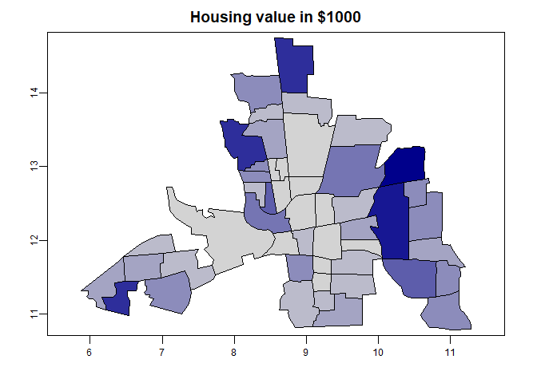
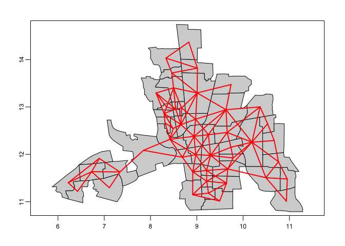
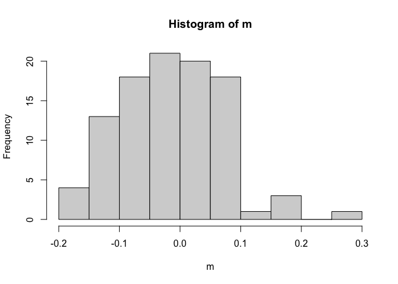

# Set up

**resources we are referencing:  

- http://www.css.cornell.edu/faculty/dgr2/_static/files/ov/ov_ADSA_Handout.pdf  
- Banerjee, Carlin and Gelfand, Hierarchical Modeling and Analysis for Spatial Data, 1st Edition, Ch 3  
- Bivand et al 2013 Ch 9  
- rspatial.org  

The packages we used are:  

```r
# install.packages(c("sp", "raster", "spdep", ....))
library(tidyverse)
library(sp)
# library(spData)
# library(raster) # or terra
library(terra)
library(spdep)
library(sf)
## more...
```

The dataset we are using is published in `spData` and comes from: _Anselin, Luc. 1988. Spatial econometrics: methods and models. Dordrecht: Kluwer Academic, Table 12.1 p. 189._

```r
## load dataset(s)
columbus <- vect(system.file("shapes/columbus.shp", package="spData")[1])
df.columbus <- as.data.frame(columbus)
glimpse(df.columbus)
```

```
## Rows: 49
## Columns: 20
## $ AREA       <dbl> 0.309441, 0.259329, 0.192468, 0.083841, 0.488888, 0.283079,…
## $ PERIMETER  <dbl> 2.440629, 2.236939, 2.187547, 1.427635, 2.997133, 2.335634,…
## $ COLUMBUS_  <dbl> 2, 3, 4, 5, 6, 7, 8, 9, 10, 11, 12, 13, 14, 15, 16, 17, 18,…
## $ COLUMBUS_I <dbl> 5, 1, 6, 2, 7, 8, 4, 3, 18, 10, 38, 37, 39, 40, 9, 36, 11, …
## $ POLYID     <dbl> 1, 2, 3, 4, 5, 6, 7, 8, 9, 10, 11, 12, 13, 14, 15, 16, 17, …
## $ NEIG       <dbl> 5, 1, 6, 2, 7, 8, 4, 3, 18, 10, 38, 37, 39, 40, 9, 36, 11, …
## $ HOVAL      <dbl> 80.467, 44.567, 26.350, 33.200, 23.225, 28.750, 75.000, 37.…
## $ INC        <dbl> 19.531, 21.232, 15.956, 4.477, 11.252, 16.029, 8.438, 11.33…
## $ CRIME      <dbl> 15.725980, 18.801754, 30.626781, 32.387760, 50.731510, 26.0…
## $ OPEN       <dbl> 2.850747, 5.296720, 4.534649, 0.394427, 0.405664, 0.563075,…
## $ PLUMB      <dbl> 0.217155, 0.320581, 0.374404, 1.186944, 0.624596, 0.254130,…
## $ DISCBD     <dbl> 5.03, 4.27, 3.89, 3.70, 2.83, 3.78, 2.74, 2.89, 3.17, 4.33,…
## $ X          <dbl> 38.80, 35.62, 39.82, 36.50, 40.01, 43.75, 33.36, 36.71, 43.…
## $ Y          <dbl> 44.07, 42.38, 41.18, 40.52, 38.00, 39.28, 38.41, 38.71, 35.…
## $ NSA        <dbl> 1, 1, 1, 1, 1, 1, 1, 1, 1, 1, 1, 1, 1, 1, 1, 1, 1, 1, 1, 0,…
## $ NSB        <dbl> 1, 1, 1, 1, 1, 1, 1, 1, 1, 1, 1, 1, 1, 1, 1, 1, 1, 1, 1, 1,…
## $ EW         <dbl> 1, 0, 1, 0, 1, 1, 0, 0, 1, 1, 0, 0, 0, 0, 1, 0, 1, 0, 0, 1,…
## $ CP         <dbl> 0, 0, 0, 0, 0, 0, 0, 0, 0, 0, 1, 1, 1, 1, 1, 1, 0, 1, 1, 0,…
## $ THOUS      <dbl> 1000, 1000, 1000, 1000, 1000, 1000, 1000, 1000, 1000, 1000,…
## $ NEIGNO     <dbl> 1005, 1001, 1006, 1002, 1007, 1008, 1004, 1003, 1018, 1010,…
```

The county data is:  

* HOVAL housing value (in \$1,000)  
* INC household income (in \$1,000)  
* CRIME residential burglaries and vehicle thefts per thousand households in the neighborhood  
* OPEN open space in neighborhood  
* PLUMB percentage housing units without plumbing  

Look at some summaries of those metrics: _Kayla_   



# Exploratory Data Analysis  

## Measures of spatial association  

### Neighbors _Kayla_  
adjecency matrix construction - nearest neighbors, categories, 1/dist  
Figures out what the neighbors are:  

```r
xy <- centroids(columbus)
head(neighbors <- adjacent(columbus, symmetrical=TRUE))
```

```
##      from to
## [1,]    1  2
## [2,]    1  3
## [3,]    2  3
## [4,]    2  4
## [5,]    3  4
## [6,]    3  5
```

```r
plot(columbus, col='lightgray', border='black', lwd=1)
p1 <- xy[neighbors[,1], ]
p2 <- xy[neighbors[,2], ]
lines(p1, p2, col='red', lwd=2)
```

<!-- -->

As an adjecency matrix  

```r
head(neighbors <- adjacent(columbus, pairs = FALSE))
```

```
##   1 2 3 4 5 6 7 8 9 10 11 12 13 14 15 16 17 18 19 20 21 22 23 24 25 26 27 28 29
## 1 0 1 1 0 0 0 0 0 0  0  0  0  0  0  0  0  0  0  0  0  0  0  0  0  0  0  0  0  0
## 2 1 0 1 1 0 0 0 0 0  0  0  0  0  0  0  0  0  0  0  0  0  0  0  0  0  0  0  0  0
## 3 1 1 0 1 1 0 0 0 0  0  0  0  0  0  0  0  0  0  0  0  0  0  0  0  0  0  0  0  0
## 4 0 1 1 0 1 0 0 1 0  0  0  0  0  0  0  0  0  0  0  0  0  0  0  0  0  0  0  0  0
## 5 0 0 1 1 0 1 0 1 1  0  1  0  0  0  1  0  0  0  0  0  0  0  0  0  0  0  0  0  0
## 6 0 0 0 0 1 0 0 0 1  0  0  0  0  0  0  0  0  0  0  0  0  0  0  0  0  0  0  0  0
##   30 31 32 33 34 35 36 37 38 39 40 41 42 43 44 45 46 47 48 49
## 1  0  0  0  0  0  0  0  0  0  0  0  0  0  0  0  0  0  0  0  0
## 2  0  0  0  0  0  0  0  0  0  0  0  0  0  0  0  0  0  0  0  0
## 3  0  0  0  0  0  0  0  0  0  0  0  0  0  0  0  0  0  0  0  0
## 4  0  0  0  0  0  0  0  0  0  0  0  0  0  0  0  0  0  0  0  0
## 5  0  0  0  0  0  0  0  0  0  0  0  0  0  0  0  0  0  0  0  0
## 6  0  0  0  0  0  0  0  0  0  0  0  0  0  0  0  0  0  0  0  0
```

### Moran's I - _Kayla_  
Using `spdep` 

$$
I=\frac{n}{\sum_{i=1}^{n} (y_{i}-\overline{y})^{2}} \frac{\sum_{i=1}^{n} \sum_{j=1}^{n} w_{ij} (y_{i}-\overline{y}) (y_{j}-\overline{y})}{\sum_{i=1}^{n} \sum_{j=1}^{n} w_{ij}}
$$
*** I'm seeing the formula written in 2 ways above, and with denominator's flipped
#### House value  

```r
## Moran's I
ww <-  adjacent(columbus, "touches", pairs=FALSE)
(ac <- autocor(columbus$HOVAL, ww, "moran"))
```

```
## [1] 0.2213441
```

```r
## Monte Carlo sim to test for significance (I'm following https://rspatial.org/terra/analysis/3-spauto.html#compute-morans-i)
m <- sapply(1:99, function(i) {
    autocor(sample(columbus$HOVAL), ww, "moran")
})
hist(m)
```



```r
## p-value
sum(m >= ac) / 100
```

```
## [1] 0
```
So there is some (Moran's I range (-1 to 1) = 0.2213441) spatial autocorrelation in house value by county in Columbus Ohio.

#### Household income  

```r
## Moran's I
(ac <- autocor(columbus$INC, ww, "moran"))
```

```
## [1] 0.412344
```

```r
## Monte Carlo sim to test for significance (I'm following https://rspatial.org/terra/analysis/3-spauto.html#compute-morans-i)
m <- sapply(1:99, function(i) {
    autocor(sample(columbus$INC), ww, "moran")
})
hist(m)
```



```r
## p-value
sum(m >= ac) / 100
```

```
## [1] 0
```
There is also positive (Moran's I = 0.412344) Spatial autocorrelation in household income.   

#### Crime  

```r
## Moran's I
(ac <- autocor(columbus$CRIME, ww, "moran"))
```

```
## [1] 0.5154614
```

```r
## Monte Carlo sim to test for significance (I'm following https://rspatial.org/terra/analysis/3-spauto.html#compute-morans-i)
m <- sapply(1:99, function(i) {
    autocor(sample(columbus$CRIME), ww, "moran")
})
hist(m)
```


```r
## p-value
sum(m >= ac) / 100
```

```
## [1] 0
```
So again we see local spatial autocorrelation (Moran's I = 0.5154614).  

### Geary's C  __Ingmar__

$$
C=\frac{(n-1) \sum_{i} \sum_{j} w_{i j}\left(Y_{i}-Y_{j}\right)^{2}}{2\left(\sum_{i \neq j} w_{i j}\right) \sum_{i}\left(Y_{i}-\bar{Y}\right)^{2}}
$$

Reinhard Furrer (http://user.math.uzh.ch/furrer/download/sta330/script_sta330.pdf, Version May 26, 2021) suggests to take 1-C to compare it to Moran's I more easily.


```r
(gearyc <- autocor(columbus$HOVAL, ww, "geary"))
```

```
## [1] 0.7889937
```

```r
1-gearyc
```

```
## [1] 0.2110063
```


## Spatial smoothers  
Could delve further into this for the final project eg smoothing in image classification of fragmented habitats is problematic.  

### Clustering  

### Markov random fields  

# Spatial regression models

## Zero means _Ingmar_

$$
\mathit{HOVAL} = \frac{1}{n}\sum_{i=1}^{n}\mathit{HOVAL}
$$


```r
# make spatial vector to simple feature
columbus.sf <- sf::st_as_sf(columbus)

zero.means <- lm(HOVAL ~ 1, data=columbus.sf)
summary(zero.means)
```

```
## 
## Call:
## lm(formula = HOVAL ~ 1, data = columbus.sf)
## 
## Residuals:
##     Min      1Q  Median      3Q     Max 
## -20.536 -12.736  -4.936   4.864  57.964 
## 
## Coefficients:
##             Estimate Std. Error t value Pr(>|t|)    
## (Intercept)   38.436      2.638   14.57   <2e-16 ***
## ---
## Signif. codes:  0 '***' 0.001 '**' 0.01 '*' 0.05 '.' 0.1 ' ' 1
## 
## Residual standard error: 18.47 on 48 degrees of freedom
```


## Simultaneous Autoregressive Models  

### SAR error model _Ingmar_

Use global moran's i to test model residuals for spatial correlation
lm.morantest()


```r
# make simple feature to neighborhood
columbus.nb <- poly2nb(columbus.sf)

# make neighborhood to list of weights
lw <- nb2listw(columbus.nb, style="W")

# estimate error SAR model without transformation
col.errW.eig <- errorsarlm(HOVAL~INC+CRIME+OPEN+CP, data=columbus.sf,
 lw, method="eigen", quiet=T)

# look at the residuals
hist(residuals(col.errW.eig))
```

<!-- -->


```r
# estimate error SAR model with log transformation
col.errW.eig.log <- errorsarlm(log(HOVAL)~INC+CRIME+OPEN+CP, data=columbus.sf,
 lw, method="eigen", quiet=T)

hist(residuals(col.errW.eig.log))
```

<!-- -->

```r
# print model summary
summary(col.errW.eig.log, correlation=TRUE)
```

```
## 
## Call:
## errorsarlm(formula = log(HOVAL) ~ INC + CRIME + OPEN + CP, data = columbus.sf, 
##     listw = lw, method = "eigen", quiet = T)
## 
## Residuals:
##       Min        1Q    Median        3Q       Max 
## -0.503081 -0.190516 -0.051521  0.055445  0.855101 
## 
## Type: error 
## Coefficients: (asymptotic standard errors) 
##               Estimate Std. Error z value Pr(>|z|)
## (Intercept)  3.7832959  0.2525868 14.9782  < 2e-16
## INC          0.0134509  0.0104770  1.2839  0.19919
## CRIME       -0.0099247  0.0042443 -2.3383  0.01937
## OPEN         0.0194551  0.0086313  2.2540  0.02420
## CP          -0.2520210  0.1435112 -1.7561  0.07907
## 
## Lambda: 0.45625, LR test value: 5.3082, p-value: 0.021226
## Asymptotic standard error: 0.15476
##     z-value: 2.9482, p-value: 0.0031967
## Wald statistic: 8.6916, p-value: 0.0031967
## 
## Log likelihood: -9.062429 for error model
## ML residual variance (sigma squared): 0.08037, (sigma: 0.2835)
## Number of observations: 49 
## Number of parameters estimated: 7 
## AIC: 32.125, (AIC for lm: 35.433)
## 
##  Correlation of coefficients 
##             sigma lambda (Intercept) INC   CRIME OPEN 
## lambda      -0.20                                     
## (Intercept)  0.00  0.00                               
## INC          0.00  0.00  -0.85                        
## CRIME        0.00  0.00  -0.67        0.38            
## OPEN         0.00  0.00   0.04       -0.18  0.03      
## CP           0.00  0.00  -0.09        0.20 -0.50 -0.17
```


### SAR lag and Durbin models _Will_


library(rgdal)

hoval <- columbus$INC ~ columbus$HOVAL
poly <- readOGR(system.file("shapes/columbus.shp", package="spData")[1])

nb <- poly2nb(poly)
lag <- lagsarlm(formula=hoval,data=df.columbus,listw=nb2listw(nb))
durbin <- lagsarlm(formula=hoval,data=df.columbus,listw=nb2listw(nb),Durbin=TRUE)

columbus$INC$residuals <- residuals(lag)

### Likelihood Ratio _Ingmar_

### Model comparisons  _Ingmar_

## Conditional Autoregressive Models  _Hanmo_

### Gaussian case  

### non-Gaussian case  

### Model comparisons  

