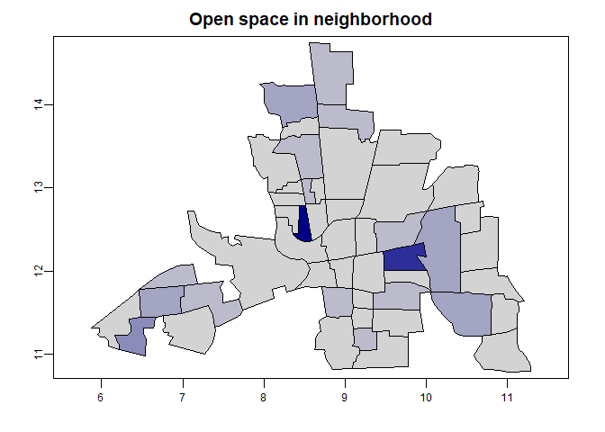
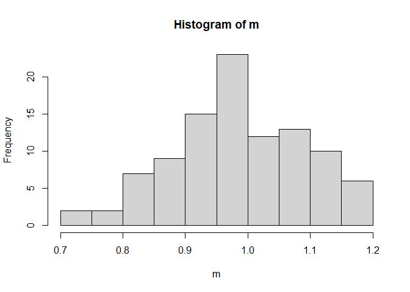
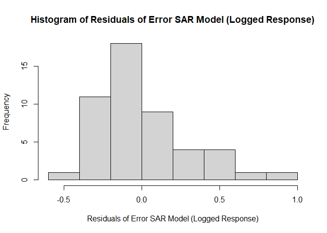
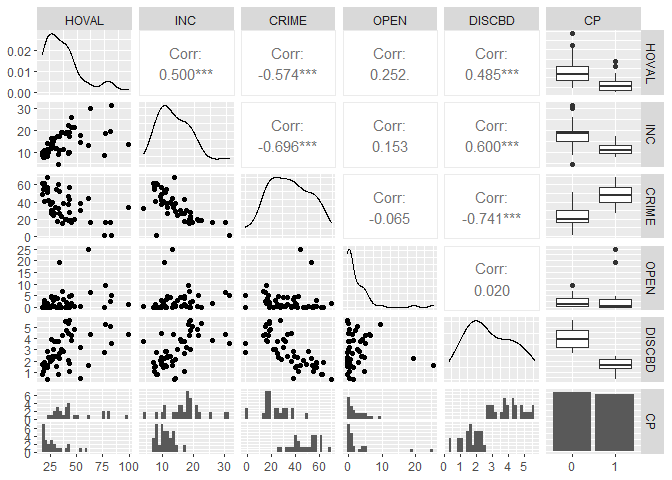

# Set up

**resources we are referencing:  

- http://www.css.cornell.edu/faculty/dgr2/_static/files/ov/ov_ADSA_Handout.pdf  
- Banerjee, Carlin and Gelfand, Hierarchical Modeling and Analysis for Spatial Data, 1st Edition, Ch 3  
- Bivand et al 2013 Ch 9  
- rspatial.org  

The packages we used are:  

```r
# install.packages(c("sp", "raster", "spdep", ....))
library(tidyverse)
library(sp)
# library(spData)
# library(raster) # or terra
library(terra)
library(spdep)
library(sf)
library(GGally)
library(ape)
## more...
```

The dataset we are using is published in `spData` and comes from: _Anselin, Luc. 1988. Spatial econometrics: methods and models. Dordrecht: Kluwer Academic, Table 12.1 p. 189._

```r
## load dataset(s)
columbus <- vect(system.file("shapes/columbus.shp", package="spData")[1])
df.columbus <- as.data.frame(columbus)
glimpse(df.columbus)
```

```
## Rows: 49
## Columns: 20
## $ AREA       <dbl> 0.309441, 0.259329, 0.192468, 0.083841, 0.488888, 0.283079,…
## $ PERIMETER  <dbl> 2.440629, 2.236939, 2.187547, 1.427635, 2.997133, 2.335634,…
## $ COLUMBUS_  <dbl> 2, 3, 4, 5, 6, 7, 8, 9, 10, 11, 12, 13, 14, 15, 16, 17, 18,…
## $ COLUMBUS_I <dbl> 5, 1, 6, 2, 7, 8, 4, 3, 18, 10, 38, 37, 39, 40, 9, 36, 11, …
## $ POLYID     <dbl> 1, 2, 3, 4, 5, 6, 7, 8, 9, 10, 11, 12, 13, 14, 15, 16, 17, …
## $ NEIG       <dbl> 5, 1, 6, 2, 7, 8, 4, 3, 18, 10, 38, 37, 39, 40, 9, 36, 11, …
## $ HOVAL      <dbl> 80.467, 44.567, 26.350, 33.200, 23.225, 28.750, 75.000, 37.…
## $ INC        <dbl> 19.531, 21.232, 15.956, 4.477, 11.252, 16.029, 8.438, 11.33…
## $ CRIME      <dbl> 15.725980, 18.801754, 30.626781, 32.387760, 50.731510, 26.0…
## $ OPEN       <dbl> 2.850747, 5.296720, 4.534649, 0.394427, 0.405664, 0.563075,…
## $ PLUMB      <dbl> 0.217155, 0.320581, 0.374404, 1.186944, 0.624596, 0.254130,…
## $ DISCBD     <dbl> 5.03, 4.27, 3.89, 3.70, 2.83, 3.78, 2.74, 2.89, 3.17, 4.33,…
## $ X          <dbl> 38.80, 35.62, 39.82, 36.50, 40.01, 43.75, 33.36, 36.71, 43.…
## $ Y          <dbl> 44.07, 42.38, 41.18, 40.52, 38.00, 39.28, 38.41, 38.71, 35.…
## $ NSA        <dbl> 1, 1, 1, 1, 1, 1, 1, 1, 1, 1, 1, 1, 1, 1, 1, 1, 1, 1, 1, 0,…
## $ NSB        <dbl> 1, 1, 1, 1, 1, 1, 1, 1, 1, 1, 1, 1, 1, 1, 1, 1, 1, 1, 1, 1,…
## $ EW         <dbl> 1, 0, 1, 0, 1, 1, 0, 0, 1, 1, 0, 0, 0, 0, 1, 0, 1, 0, 0, 1,…
## $ CP         <dbl> 0, 0, 0, 0, 0, 0, 0, 0, 0, 0, 1, 1, 1, 1, 1, 1, 0, 1, 1, 0,…
## $ THOUS      <dbl> 1000, 1000, 1000, 1000, 1000, 1000, 1000, 1000, 1000, 1000,…
## $ NEIGNO     <dbl> 1005, 1001, 1006, 1002, 1007, 1008, 1004, 1003, 1018, 1010,…
```

The county data is:  

* HOVAL housing value (in \$1,000)  
* INC household income (in \$1,000)  
* CRIME residential burglaries and vehicle thefts per thousand households in the neighborhood  
* OPEN open space in neighborhood  
* PLUMB percentage housing units without plumbing  

Look at some summaries of those metrics: _Kayla_   


Because we plan to use housing value as our response variable try a transformation.  

```r
hist(log10(df.columbus$HOVAL), 
     main = "Housing value", 
     xlab = "Value  in $1000 (log_10)")
```

<!-- -->

# Exploratory Data Analysis  

## Measures of spatial association  

### Neighbors _Kayla_  
adjecency matrix construction - nearest neighbors, categories, 1/dist  
Figures out what the neighbors are:  

```r
xy <- centroids(columbus)
head(neighbors <- adjacent(columbus, symmetrical=TRUE))
```

```
##      from to
## [1,]    1  2
## [2,]    1  3
## [3,]    2  3
## [4,]    2  4
## [5,]    3  4
## [6,]    3  5
```

```r
plot(columbus, col='lightgray', border='black', lwd=1)
p1 <- xy[neighbors[,1], ]
p2 <- xy[neighbors[,2], ]
lines(p1, p2, col='red', lwd=2)
```

<!-- -->

As an adjecency matrix  

```r
head(neighbors <- adjacent(columbus, pairs = FALSE))
```

```
##   1 2 3 4 5 6 7 8 9 10 11 12 13 14 15 16 17 18 19 20 21 22 23 24 25 26 27 28 29
## 1 0 1 1 0 0 0 0 0 0  0  0  0  0  0  0  0  0  0  0  0  0  0  0  0  0  0  0  0  0
## 2 1 0 1 1 0 0 0 0 0  0  0  0  0  0  0  0  0  0  0  0  0  0  0  0  0  0  0  0  0
## 3 1 1 0 1 1 0 0 0 0  0  0  0  0  0  0  0  0  0  0  0  0  0  0  0  0  0  0  0  0
## 4 0 1 1 0 1 0 0 1 0  0  0  0  0  0  0  0  0  0  0  0  0  0  0  0  0  0  0  0  0
## 5 0 0 1 1 0 1 0 1 1  0  1  0  0  0  1  0  0  0  0  0  0  0  0  0  0  0  0  0  0
## 6 0 0 0 0 1 0 0 0 1  0  0  0  0  0  0  0  0  0  0  0  0  0  0  0  0  0  0  0  0
##   30 31 32 33 34 35 36 37 38 39 40 41 42 43 44 45 46 47 48 49
## 1  0  0  0  0  0  0  0  0  0  0  0  0  0  0  0  0  0  0  0  0
## 2  0  0  0  0  0  0  0  0  0  0  0  0  0  0  0  0  0  0  0  0
## 3  0  0  0  0  0  0  0  0  0  0  0  0  0  0  0  0  0  0  0  0
## 4  0  0  0  0  0  0  0  0  0  0  0  0  0  0  0  0  0  0  0  0
## 5  0  0  0  0  0  0  0  0  0  0  0  0  0  0  0  0  0  0  0  0
## 6  0  0  0  0  0  0  0  0  0  0  0  0  0  0  0  0  0  0  0  0
```

### Moran's I - _Kayla_  

$$
I=\frac{n}{\sum_{i=1}^{n} (y_{i}-\overline{y})^{2}} \frac{\sum_{i=1}^{n} \sum_{j=1}^{n} w_{ij} (y_{i}-\overline{y}) (y_{j}-\overline{y})}{\sum_{i=1}^{n} \sum_{j=1}^{n} w_{ij}}
$$

Using `spdep` to test for spatial autocorrelation of the variable, by county in Columbus, OH. Moran's I is a global measure of spatial autocorrelation with values ranging -1 to 1. Here we are using a neighbor's matrix for any counties that are touching each other.   

The adjacency matrix:  

```r
ww <-  adjacent(columbus, "touches", pairs=FALSE)
```

Roughly the expected value for Moran's I is $E(I)=\frac{-1}{n-1}$   

```r
-1/(nrow(columbus)-1)
```

```
## [1] -0.02083333
```

Values significantly ($\alpha = 0.05$) below that indicate negative spatial autocorrelation (a phenomena that generally occurs in random datasets) and above that indicates positive spatial autocorrelation (neighbors are more similar to each other than non-neighbors).  

*** I'm seeing the formula written in 2 ways above, and with denominator's flipped  

#### House value  

```r
## Moran's I
(ac <- autocor(columbus$HOVAL, ww, "moran"))
```

```
## [1] 0.2213441
```

```r
## Monte Carlo sim to test for significance (I'm following https://rspatial.org/terra/analysis/3-spauto.html#compute-morans-i)
m <- sapply(1:99, function(i) {
    autocor(sample(columbus$HOVAL), ww, "moran")
})
hist(m)
```


```r
## p-value
sum(m >= ac) / 100
```

```
## [1] 0.01
```

So there is not significant (Moran's I = 0.2213441, p > 0.05) spatial autocorrelation.

#### Household income  

```r
## Moran's I
(ac <- autocor(columbus$INC, ww, "moran"))
```

```
## [1] 0.412344
```

```r
## Monte Carlo sim to test for significance (I'm following https://rspatial.org/terra/analysis/3-spauto.html#compute-morans-i)
m <- sapply(1:99, function(i) {
    autocor(sample(columbus$INC), ww, "moran")
})
# hist(m)

## p-value
sum(m >= ac) / 100
```

```
## [1] 0
```

There is significant positive (Moran's I = 0.412344, p < 0.05) Spatial autocorrelation in household income.   

#### Crime  

```r
## Moran's I
(ac <- autocor(columbus$CRIME, ww, "moran"))
```

```
## [1] 0.5154614
```

```r
## Monte Carlo sim to test for significance (I'm following https://rspatial.org/terra/analysis/3-spauto.html#compute-morans-i)
m <- sapply(1:99, function(i) {
    autocor(sample(columbus$CRIME), ww, "moran")
})
# hist(m)

## p-value
sum(m >= ac) / 100
```

```
## [1] 0
```

So again we see significant spatial autocorrelation (Moran's I = 0.5154614, p > 0.05).  

#### Open space  

```r
## Moran's I
(ac <- autocor(columbus$OPEN, ww, "moran"))
```

```
## [1] -0.03669849
```

```r
## Monte Carlo sim to test for significance (I'm following https://rspatial.org/terra/analysis/3-spauto.html#compute-morans-i)
m <- sapply(1:99, function(i) {
    autocor(sample(columbus$HOVAL), ww, "moran")
})
# hist(m)

## p-value
sum(m >= ac) / 100
```

```
## [1] 0.45
```


There is not spatial autocorrelation with open space (Moran's I = -0.0366985; p-value > 0.05)

#### Plumbing  

```r
## Moran's I
(ac <- autocor(columbus$PLUMB, ww, "moran"))
```

```
## [1] 0.4550575
```

```r
## Monte Carlo sim to test for significance (I'm following https://rspatial.org/terra/analysis/3-spauto.html#compute-morans-i)
m <- sapply(1:99, function(i) {
    autocor(sample(columbus$HOVAL), ww, "moran")
})
# hist(m)

## p-value
sum(m >= ac) / 100
```

```
## [1] 0
```


There is significant spatial autocorrelation with plumbing (Moran's I = 0.4550575, p < 0.05).

### Geary's C  __Ingmar__

$$
C=\frac{(n-1) \sum_{i} \sum_{j} w_{i j}\left(Y_{i}-Y_{j}\right)^{2}}{2\left(\sum_{i \neq j} w_{i j}\right) \sum_{i}\left(Y_{i}-\bar{Y}\right)^{2}}
$$

Geary's C is a measure of local spatial autocorrelation that is roughly inversely related to Moran's I.  

#### House Value

```r
(gearyc <- autocor(columbus$HOVAL, ww, "geary"))
```

```
## [1] 0.7889937
```

```r
## Monte Carlo sim to test for significance 
m <- sapply(1:99, function(i) {
    autocor(sample(columbus$HOVAL), ww, "geary")
})
hist(m)
```


```r
## p-value
sum(m >= gearyc) / 100
```

```
## [1] 0.93
```

No significant spatial autocorrelation (geary's c = 0.7889937, p > 0.05).  

#### Household Income  

```r
(gearyc <- autocor(columbus$INC, ww, "geary"))
```

```
## [1] 0.7137603
```

```r
## Monte Carlo sim to test for significance 
m <- sapply(1:99, function(i) {
    autocor(sample(columbus$INC), ww, "geary")
})
# hist(m)

## p-value
sum(m >= gearyc) / 100
```

```
## [1] 0.98
```

No significant spatial autocorrelation (geary's c = 0.7137603, p > 0.05).  

#### Crime  

```r
(gearyc <- autocor(columbus$CRIME, ww, "geary"))
```

```
## [1] 0.5916113
```

```r
## Monte Carlo sim to test for significance 
m <- sapply(1:99, function(i) {
    autocor(sample(columbus$CRIME), ww, "geary")
})
hist(m)
```

<!-- -->

```r
## p-value
sum(m >= gearyc) / 100
```

```
## [1] 0.99
```

No significant spatial autocorrelation (geary's c = 0.5916113, p > 0.05).  

#### Open space  

```r
(gearyc <- autocor(columbus$OPEN, ww, "geary"))
```

```
## [1] 0.878182
```

```r
## Monte Carlo sim to test for significance 
m <- sapply(1:99, function(i) {
    autocor(sample(columbus$OPEN), ww, "geary")
})
# hist(m)

## p-value
sum(m >= gearyc) / 100
```

```
## [1] 0.7
```

No significant spatial autocorrelation (geary's c = 0.878182, p > 0.05).  

#### Plumbing  

```r
(gearyc <- autocor(columbus$PLUMB, ww, "geary"))
```

```
## [1] 0.6806864
```

```r
## Monte Carlo sim to test for significance 
m <- sapply(1:99, function(i) {
    autocor(sample(columbus$PLUMB), ww, "geary")
})
# hist(m)

## p-value
sum(m >= gearyc) / 100
```

```
## [1] 0.92
```

No significant spatial autocorrelation (geary's c = 0.6806864, p > 0.05).  

### Compare Moran's I and Geary's C  
Reinhard Furrer (http://user.math.uzh.ch/furrer/download/sta330/script_sta330.pdf, Version May 26, 2021) suggests to take 1-C to compare it to Moran's I more easily.  

\begin{tabular}{l|r|l|r|r|l}
\hline
  & Morans\_I & signif & Gearys\_C & One\_minus\_Gearys\_C & signif.1\\
\hline
House value & 0.221 &  & 0.789 & 0.211 & \\
\hline
Income & 0.412 & * & 0.714 & 0.286 & \\
\hline
Crime & 0.515 & * & 0.592 & 0.408 & \\
\hline
Open space & -0.037 &  & 0.878 & 0.122 & \\
\hline
Plumbing & 0.455 & * & 0.681 & 0.319 & \\
\hline
\end{tabular}

There are differences observed in local and global spatial autocorrelation in the data. For both Moran's I and Geary's C there was not significant spatial autocorrelation in house value or Open space. There was significant postive global spatial autocorrelation in household income, crime, and plumbing using Moran's I, but no significant local spatial autocorrelation.  

# Spatial regression models

## Zero means _Ingmar_

We decide to model the \textit{HOVAL} (home value) variable for all of our models. The simplest, yet naive, model is the zero means model, which is essentially an intercept-only model, i.e. the average of the \textit{HOVAL} variable. We decide to start at this point to address each of the models' shortcomings with each improved model.

$$
\mathit{HOVAL} = \frac{1}{n}\sum_{i=1}^{n}\mathit{HOVAL}
$$

We estimate the model using \texttt{lm} function:


```r
# make spatial vector to simple feature
columbus.sf <- sf::st_as_sf(columbus)
zero.means <- lm(HOVAL ~ 1, data=columbus.sf)
summary(zero.means)
```

```
## 
## Call:
## lm(formula = HOVAL ~ 1, data = columbus.sf)
## 
## Residuals:
##     Min      1Q  Median      3Q     Max 
## -20.536 -12.736  -4.936   4.864  57.964 
## 
## Coefficients:
##             Estimate Std. Error t value Pr(>|t|)    
## (Intercept)   38.436      2.638   14.57   <2e-16 ***
## ---
## Signif. codes:  0 '***' 0.001 '**' 0.01 '*' 0.05 '.' 0.1 ' ' 1
## 
## Residual standard error: 18.47 on 48 degrees of freedom
```

We find the average home value is \$38436. Since we will use the log-transformed home value for subsequent models, we repeat the zero means model for the transformed variable for purposes of comparison.


```r
# estimate log-transformed model
zero.means.log <- lm(log(HOVAL) ~ 1, data=columbus.sf)
summary(zero.means.log)
```

```
## 
## Call:
## lm(formula = log(HOVAL) ~ 1, data = columbus.sf)
## 
## Residuals:
##      Min       1Q   Median       3Q      Max 
## -0.66751 -0.30582 -0.04076  0.21585  1.01620 
## 
## Coefficients:
##             Estimate Std. Error t value Pr(>|t|)    
## (Intercept)  3.55231    0.06178    57.5   <2e-16 ***
## ---
## Signif. codes:  0 '***' 0.001 '**' 0.01 '*' 0.05 '.' 0.1 ' ' 1
## 
## Residual standard error: 0.4324 on 48 degrees of freedom
```

We find that the model estimates \textit{log(HOVAL)} to be 3.55231, which is \$34894 when transformed back.

## Linear Model with Independent Residuals _Ingmar_

Improving over the zero means model, we model the home value \textit{HOVAL} as a linear function of its covariates with independent errors.

$$
\mathbf{HOVAL} = \mathbf{X}\beta + \varepsilon
$$

where X is a matrix of the predictors \textit{INC} (income), \textit{CRIME}, \textit{OPEN} (open space in neighborhood), and \textit{CP} (whether the neighborhood is in the center or periphery). 

We estimate the model with


```r
col.lm <- lm(HOVAL~INC+CRIME+OPEN, data=columbus.sf)
summary(col.lm)
```

```
## 
## Call:
## lm(formula = HOVAL ~ INC + CRIME + OPEN, data = columbus.sf)
## 
## Residuals:
##     Min      1Q  Median      3Q     Max 
## -17.902  -9.296  -3.969   5.608  58.742 
## 
## Coefficients:
##             Estimate Std. Error t value Pr(>|t|)    
## (Intercept)  46.7984    12.9397   3.617 0.000751 ***
## INC           0.4946     0.5316   0.930 0.357130    
## CRIME        -0.5024     0.1795  -2.800 0.007509 ** 
## OPEN          0.7858     0.4677   1.680 0.099839 .  
## ---
## Signif. codes:  0 '***' 0.001 '**' 0.01 '*' 0.05 '.' 0.1 ' ' 1
## 
## Residual standard error: 14.92 on 45 degrees of freedom
## Multiple R-squared:  0.3879,	Adjusted R-squared:  0.3471 
## F-statistic: 9.506 on 3 and 45 DF,  p-value: 5.588e-05
```


```r
par(mfrow=c(2,2))
plot(col.lm)
```

<!-- -->

The diagnostic plots show that the assumptions of regression are not satisfied, which is to be expected since we know that most areal data is spatially dependent.

## Simultaneous Autoregressive Models  

### SAR error model _Ingmar_

Use global moran's i to test model residuals for spatial correlation
lm.morantest()

To address the shortcomings of the linear model under the assumption of independent errors, we introduce Simultaneous Autoregressive Models. The models solve simultaneously for the regression coefficients and for the autoregressive error structure.

, we The solution is to use models that simultaneously solve for:
1 the regression coefficients, i.e., the effects of the predictors on the
response;
2 the autoregressive error structure, i.e., the strength and nature of
the spatial autocorrelation
Several forms of this, depending the cause of spatial autocorrelation:
as a result of accounting for the predictors; a spatially-correlated
residual effect: ‘induced spatial dependence’ (“spatial error
model”)


```r
# make simple feature to neighborhood
columbus.nb <- poly2nb(columbus.sf)

# make neighborhood to list of weights
lw <- nb2listw(columbus.nb, style="W")

# estimate error SAR model without transformation
col.errW.eig <- errorsarlm(HOVAL~INC+CRIME+OPEN+CP, data=columbus.sf,
 lw, method="eigen", quiet=T)

# look at the residuals
hist(residuals(col.errW.eig))
```

<!-- -->


```r
# estimate error SAR model with log transformation
col.errW.eig.log <- errorsarlm(log(HOVAL)~INC+CRIME+OPEN+CP, data=columbus.sf,
 lw, method="eigen", quiet=T)

hist(residuals(col.errW.eig.log))
```

<!-- -->

```r
# print model summary
summary(col.errW.eig.log, correlation=TRUE)
```

```
## 
## Call:
## errorsarlm(formula = log(HOVAL) ~ INC + CRIME + OPEN + CP, data = columbus.sf, 
##     listw = lw, method = "eigen", quiet = T)
## 
## Residuals:
##       Min        1Q    Median        3Q       Max 
## -0.503081 -0.190516 -0.051521  0.055445  0.855101 
## 
## Type: error 
## Coefficients: (asymptotic standard errors) 
##               Estimate Std. Error z value Pr(>|z|)
## (Intercept)  3.7832959  0.2525868 14.9782  < 2e-16
## INC          0.0134509  0.0104770  1.2839  0.19919
## CRIME       -0.0099247  0.0042443 -2.3383  0.01937
## OPEN         0.0194551  0.0086313  2.2540  0.02420
## CP          -0.2520210  0.1435112 -1.7561  0.07907
## 
## Lambda: 0.45625, LR test value: 5.3082, p-value: 0.021226
## Asymptotic standard error: 0.15476
##     z-value: 2.9482, p-value: 0.0031967
## Wald statistic: 8.6916, p-value: 0.0031967
## 
## Log likelihood: -9.062429 for error model
## ML residual variance (sigma squared): 0.08037, (sigma: 0.2835)
## Number of observations: 49 
## Number of parameters estimated: 7 
## AIC: 32.125, (AIC for lm: 35.433)
## 
##  Correlation of coefficients 
##             sigma lambda (Intercept) INC   CRIME OPEN 
## lambda      -0.20                                     
## (Intercept)  0.00  0.00                               
## INC          0.00  0.00  -0.85                        
## CRIME        0.00  0.00  -0.67        0.38            
## OPEN         0.00  0.00   0.04       -0.18  0.03      
## CP           0.00  0.00  -0.09        0.20 -0.50 -0.17
```


```r
# Run Moran's I test for col.errW.eig.log
moran.test(residuals(col.errW.eig.log), lw) # not significant
```

```
## 
## 	Moran I test under randomisation
## 
## data:  residuals(col.errW.eig.log)  
## weights: lw    
## 
## Moran I statistic standard deviate = 0.36942, p-value = 0.3559
## alternative hypothesis: greater
## sample estimates:
## Moran I statistic       Expectation          Variance 
##       0.013061791      -0.020833333       0.008418433
```


### SAR lag and Durbin models _Will_


```r
library(rgdal)

hoval <- columbus$INC ~ columbus$HOVAL
poly <- readOGR(system.file("shapes/columbus.shp", package="spData")[1])
```

```
## OGR data source with driver: ESRI Shapefile 
## Source: "/Library/Frameworks/R.framework/Versions/4.0/Resources/library/spData/shapes/columbus.shp", layer: "columbus"
## with 49 features
## It has 20 fields
## Integer64 fields read as strings:  COLUMBUS_ COLUMBUS_I POLYID
```

```r
nb <- poly2nb(poly)
lag <- lagsarlm(formula=hoval,data=df.columbus,listw=nb2listw(nb))
durbin <- lagsarlm(formula=hoval,data=df.columbus,listw=nb2listw(nb),Durbin=TRUE)

columbus$INC$residuals <- residuals(lag)
```


### Likelihood Ratio _Ingmar_

### Model comparisons  _Ingmar_

## Conditional Autoregressive Models  _Hanmo_

In the next step, we implement the conditional autoregressive (CAR) model on the Columbus data to study the impact of covariates on House values in Columbus, OH, 1980 with spatial information. 

The CAR model essentially assumes the spatial estimation is conditional on the value of neighbors. As a typical Bayes model, CAR model assumes prior distribution on the model parameters and applies computationally intensive sampling techniques like Markov Chain Monte Carlo (MCMC) or MCMC with Gibbs sampling to find the fitted parameters.


Since we have one response variable *House value*, the CAR model has only one random effect $\phi_k$ at each spatial location $k$. Because *House value* is continuous, Gaussian distribution is preferred for the CAR model and we take logarithm of the *House value* as well to make it normally distributed.


The package *CARBayes* by Duncan Lee is used to apply the CAR model in R. The specific function we use is *S.CARleroux*, where it specifies a CAR model proposed by Brian G. Leroux in 2000. The model expression is as follows. 

* $\mathbf{W}$ is a 0-1 neighborhood or weight matrix
* $k = 1, \dots, K$ is the index for a certain areal unit
* $\rho$ is a spatial correlation parameter, with $\rho=0$ means indenpendence and $\rho=1$ indicates strong spatial correlation


$$
\psi_{k}=\phi_{k}
$$
$$
\phi_{k} \mid \phi_{-k}, \mathbf{W}, \tau^{2}, \rho \sim \mathrm{N}\left(\frac{\rho \sum_{i=1}^{K} w_{k i} \phi_{i}}{\rho \sum_{i=1}^{K} w_{k i}+1-\rho}, \frac{\tau^{2}}{\rho \sum_{i=1}^{K} w_{k i}+1-\rho}\right)
$$

$$
\begin{aligned}
\tau^{2} & \sim \operatorname{Inverse}-\operatorname{Gamma}(a, b) \\
\rho & \sim \text { Uniform }(0,1)
\end{aligned}
$$


<!-- -->


```r
set.seed(2021)
car_model_gaussian = CARBayes::S.CARleroux(log(HOVAL)~INC+CRIME+OPEN+DISCBD+CP, data = df.columbus_CAR, family = "gaussian", W = ww, burnin = 100000, n.sample = 300000, thin = 10, verbose = F)
```


Table: 95% confidence intervals for model coefficients

|            |        0.5|      0.025|      0.975|
|:-----------|----------:|----------:|----------:|
|(Intercept) |  3.7226848|  2.9525139|  4.4935939|
|INC         |  0.0146599| -0.0084353|  0.0371167|
|CRIME       | -0.0097080| -0.0189344| -0.0000474|
|OPEN        |  0.0201050|  0.0003369|  0.0400141|
|DISCBD      | -0.0001788| -0.1345074|  0.1352248|
|CP1         | -0.1957275| -0.5607323|  0.1763779|

<!-- -->

The log likelihood of this model is 17.97  while the training root mean square error (RMSE) is 59.46. From the table of $95\%$ confidence intervals for coefficients, we have

* *CRIME* and *PLUMB* are the two variables that is significant since their confidence intervals don't have zero involved.
* Hold other predictors fixed, regions with **less crimes** tend to have higher *House values*.
* Hold other predictors fixed, regions with **higher household incomes** tend to have higher *House values*.
* Hold other predictors fixed, regions with **more open area** tend to have higher *House values*.
* Hold other predictors fixed, regions with **closer distance to CBD** tend to have higher *House values*.
* Hold other predictors fixed, **core** regions tend to have higher *House values*.

<!-- -->


```r
# Moran I
Moran.I(residuals(car_model_gaussian), ww)$p.value
```

```
## [1] 0.09593303
```

We also tested the Moran's I autocorrelation coefficient for the residuals. It shows there is **no** significant spatial correlation of the residuals since the p-value $p = 0.1 > 0.05$. Therefore, our CAR model fits the areal data nicely and leaves no significant spatial information in the residuals.
 

# Conclussions  

# References  

## Packages used  


```r
citation("tidyverse")
```

```
## 
##   Wickham et al., (2019). Welcome to the tidyverse. Journal of Open
##   Source Software, 4(43), 1686, https://doi.org/10.21105/joss.01686
## 
## A BibTeX entry for LaTeX users is
## 
##   @Article{,
##     title = {Welcome to the {tidyverse}},
##     author = {Hadley Wickham and Mara Averick and Jennifer Bryan and Winston Chang and Lucy D'Agostino McGowan and Romain François and Garrett Grolemund and Alex Hayes and Lionel Henry and Jim Hester and Max Kuhn and Thomas Lin Pedersen and Evan Miller and Stephan Milton Bache and Kirill Müller and Jeroen Ooms and David Robinson and Dana Paige Seidel and Vitalie Spinu and Kohske Takahashi and Davis Vaughan and Claus Wilke and Kara Woo and Hiroaki Yutani},
##     year = {2019},
##     journal = {Journal of Open Source Software},
##     volume = {4},
##     number = {43},
##     pages = {1686},
##     doi = {10.21105/joss.01686},
##   }
```

```r
citation("sp")
```

```
## 
## To cite package sp in publications use:
## 
##   Pebesma, E.J., R.S. Bivand, 2005. Classes and methods for spatial
##   data in R. R News 5 (2), https://cran.r-project.org/doc/Rnews/.
## 
##   Roger S. Bivand, Edzer Pebesma, Virgilio Gomez-Rubio, 2013. Applied
##   spatial data analysis with R, Second edition. Springer, NY.
##   https://asdar-book.org/
## 
## To see these entries in BibTeX format, use 'print(<citation>,
## bibtex=TRUE)', 'toBibtex(.)', or set
## 'options(citation.bibtex.max=999)'.
```

```r
citation("spData")
```

```
## 
## To cite package 'spData' in publications use:
## 
##   Roger Bivand, Jakub Nowosad and Robin Lovelace (2021). spData:
##   Datasets for Spatial Analysis. R package version 2.0.1.
##   https://CRAN.R-project.org/package=spData
## 
## A BibTeX entry for LaTeX users is
## 
##   @Manual{,
##     title = {spData: Datasets for Spatial Analysis},
##     author = {Roger Bivand and Jakub Nowosad and Robin Lovelace},
##     year = {2021},
##     note = {R package version 2.0.1},
##     url = {https://CRAN.R-project.org/package=spData},
##   }
```

```r
citation("terra")
```

```
## 
## To cite package 'terra' in publications use:
## 
##   Robert J. Hijmans (2021). terra: Spatial Data Analysis. R package
##   version 1.4-7. https://CRAN.R-project.org/package=terra
## 
## A BibTeX entry for LaTeX users is
## 
##   @Manual{,
##     title = {terra: Spatial Data Analysis},
##     author = {Robert J. Hijmans},
##     year = {2021},
##     note = {R package version 1.4-7},
##     url = {https://CRAN.R-project.org/package=terra},
##   }
```

```r
citation("spdep")
```

```
## 
## To cite spdep in publications use one or more of the following as
## appropriate:
## 
##   Bivand, Roger S. and Wong, David W. S. (2018) Comparing
##   implementations of global and local indicators of spatial association
##   TEST, 27(3), 716-748. URL https://doi.org/10.1007/s11749-018-0599-x
## 
##   Roger S. Bivand, Edzer Pebesma, Virgilio Gomez-Rubio, 2013. Applied
##   spatial data analysis with R, Second edition. Springer, NY.
##   https://asdar-book.org/
## 
## To see these entries in BibTeX format, use 'print(<citation>,
## bibtex=TRUE)', 'toBibtex(.)', or set
## 'options(citation.bibtex.max=999)'.
```

## Other resources:  

```r
## rspataial, cornell thingy, 2 book chapters and paper Wendy shared
bibentry(
   bibtype = "Manual",
   title = "R Spatial",
   author = person("R Core Team"),
   organization = "R Foundation for Statistical Computing",
   address = "Vienna, Austria",
   year = 2013,
   url = "https://www.R-project.org/",
   key = "R")
```

```
## R Core Team (2013). _R Spatial_. R Foundation for Statistical
## Computing, Vienna, Austria. <URL: https://www.R-project.org/>.
```

