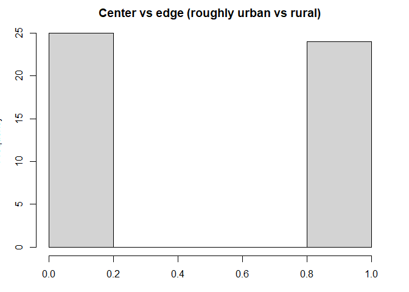
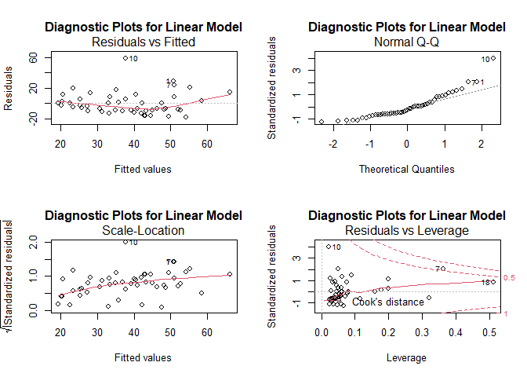
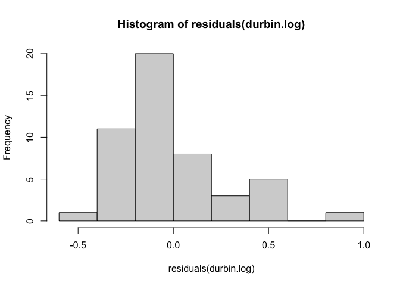
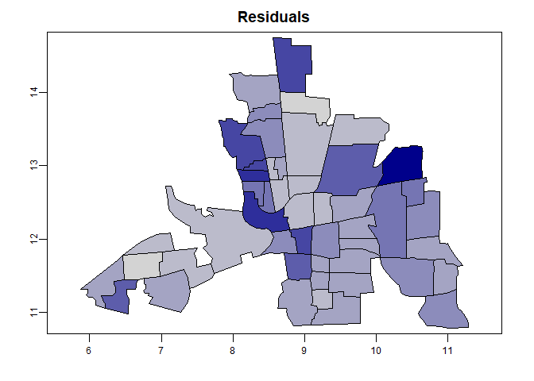

\newpage


# Set up

Resources we are referencing:  

- http://www.css.cornell.edu/faculty/dgr2/_static/files/ov/ov_ADSA_Handout.pdf  
- Banerjee, Carlin and Gelfand, Hierarchical Modeling and Analysis for Spatial Data, 1st Edition, Ch 3  
- Bivand et al 2013 Ch 9  
- rspatial.org  

The packages we used are:  

```r
library(tidyverse)
library(sp)
library(terra)
library(spdep)
library(sf)
library(GGally)
library(ape)
library(lmtest)
```

The dataset we are using is published in `spData` and comes from: _Anselin, Luc. 1988. Spatial econometrics: methods and models. Dordrecht: Kluwer Academic, Table 12.1 p. 189._

```r
## load dataset
columbus <- vect(system.file("shapes/columbus.shp", package="spData")[1])
df.columbus <- as.data.frame(columbus)
glimpse(df.columbus)
```

```
## Rows: 49
## Columns: 20
## $ AREA       <dbl> 0.309441, 0.259329, 0.192468, 0.083841, 0.488888, 0.283079,…
## $ PERIMETER  <dbl> 2.440629, 2.236939, 2.187547, 1.427635, 2.997133, 2.335634,…
## $ COLUMBUS_  <dbl> 2, 3, 4, 5, 6, 7, 8, 9, 10, 11, 12, 13, 14, 15, 16, 17, 18,…
## $ COLUMBUS_I <dbl> 5, 1, 6, 2, 7, 8, 4, 3, 18, 10, 38, 37, 39, 40, 9, 36, 11, …
## $ POLYID     <dbl> 1, 2, 3, 4, 5, 6, 7, 8, 9, 10, 11, 12, 13, 14, 15, 16, 17, …
## $ NEIG       <dbl> 5, 1, 6, 2, 7, 8, 4, 3, 18, 10, 38, 37, 39, 40, 9, 36, 11, …
## $ HOVAL      <dbl> 80.467, 44.567, 26.350, 33.200, 23.225, 28.750, 75.000, 37.…
## $ INC        <dbl> 19.531, 21.232, 15.956, 4.477, 11.252, 16.029, 8.438, 11.33…
## $ CRIME      <dbl> 15.725980, 18.801754, 30.626781, 32.387760, 50.731510, 26.0…
## $ OPEN       <dbl> 2.850747, 5.296720, 4.534649, 0.394427, 0.405664, 0.563075,…
## $ PLUMB      <dbl> 0.217155, 0.320581, 0.374404, 1.186944, 0.624596, 0.254130,…
## $ DISCBD     <dbl> 5.03, 4.27, 3.89, 3.70, 2.83, 3.78, 2.74, 2.89, 3.17, 4.33,…
## $ X          <dbl> 38.80, 35.62, 39.82, 36.50, 40.01, 43.75, 33.36, 36.71, 43.…
## $ Y          <dbl> 44.07, 42.38, 41.18, 40.52, 38.00, 39.28, 38.41, 38.71, 35.…
## $ NSA        <dbl> 1, 1, 1, 1, 1, 1, 1, 1, 1, 1, 1, 1, 1, 1, 1, 1, 1, 1, 1, 0,…
## $ NSB        <dbl> 1, 1, 1, 1, 1, 1, 1, 1, 1, 1, 1, 1, 1, 1, 1, 1, 1, 1, 1, 1,…
## $ EW         <dbl> 1, 0, 1, 0, 1, 1, 0, 0, 1, 1, 0, 0, 0, 0, 1, 0, 1, 0, 0, 1,…
## $ CP         <dbl> 0, 0, 0, 0, 0, 0, 0, 0, 0, 0, 1, 1, 1, 1, 1, 1, 0, 1, 1, 0,…
## $ THOUS      <dbl> 1000, 1000, 1000, 1000, 1000, 1000, 1000, 1000, 1000, 1000,…
## $ NEIGNO     <dbl> 1005, 1001, 1006, 1002, 1007, 1008, 1004, 1003, 1018, 1010,…
```

The county data is:  

* HOVAL housing value (in \$1,000)  
* INC household income (in \$1,000)  
* CRIME residential burglaries and vehicle thefts per thousand households in the neighborhood  
* OPEN open space in neighborhood  
* PLUMB percentage housing units without plumbing  
* CP core-periphery (an urban rural proxy)  

Look at some summaries of those metrics: _Kayla_   


Because we plan to use housing value as our response variable, a logarithm transformation is applied to fix the skewness of the distribution for the variable housing value.  

```r
hist(log10(df.columbus$HOVAL), 
     main = "Housing value", 
     xlab = "Value  in $1000 (log_10)")
```

<!-- -->

# Exploratory Data Analysis  

## Measures of spatial association  

### Neighbors  
Because measures of spatial association are dependent on which neighborhoods are next to each other (or close to each other) we need to create an adjacency matrix to use in the models and test for spatial autocorrelation.

Figure out what the neighbors are:  

```r
xy <- centroids(columbus)
head(neighbors <- adjacent(columbus, "touches", symmetrical=TRUE))
```

```
##      from to
## [1,]    1  2
## [2,]    1  3
## [3,]    2  3
## [4,]    2  4
## [5,]    3  4
## [6,]    3  5
```

```r
plot(columbus, col='lightgray', border='black', lwd=1)
p1 <- xy[neighbors[,1], ]
p2 <- xy[neighbors[,2], ]
lines(p1, p2, col='red', lwd=2)
```

<!-- -->

There are a few options when making the adjecency matrix, but for our purposes we are saying that any counties touching each other are neighbors (1s) and any that aren't are not (0s).  

Here is what part of the adjacency matrix looks like:    

```r
head(adjacent(columbus, "touches", pairs = FALSE))
```

```
##   1 2 3 4 5 6 7 8 9 10 11 12 13 14 15 16 17 18 19 20 21 22 23 24 25 26 27 28 29
## 1 0 1 1 0 0 0 0 0 0  0  0  0  0  0  0  0  0  0  0  0  0  0  0  0  0  0  0  0  0
## 2 1 0 1 1 0 0 0 0 0  0  0  0  0  0  0  0  0  0  0  0  0  0  0  0  0  0  0  0  0
## 3 1 1 0 1 1 0 0 0 0  0  0  0  0  0  0  0  0  0  0  0  0  0  0  0  0  0  0  0  0
## 4 0 1 1 0 1 0 0 1 0  0  0  0  0  0  0  0  0  0  0  0  0  0  0  0  0  0  0  0  0
## 5 0 0 1 1 0 1 0 1 1  0  1  0  0  0  1  1  0  0  0  0  0  0  0  0  0  0  0  0  0
## 6 0 0 0 0 1 0 0 0 1  0  0  0  0  0  0  0  0  0  0  0  0  0  0  0  0  0  0  0  0
##   30 31 32 33 34 35 36 37 38 39 40 41 42 43 44 45 46 47 48 49
## 1  0  0  0  0  0  0  0  0  0  0  0  0  0  0  0  0  0  0  0  0
## 2  0  0  0  0  0  0  0  0  0  0  0  0  0  0  0  0  0  0  0  0
## 3  0  0  0  0  0  0  0  0  0  0  0  0  0  0  0  0  0  0  0  0
## 4  0  0  0  0  0  0  0  0  0  0  0  0  0  0  0  0  0  0  0  0
## 5  0  0  0  0  0  0  0  0  0  0  0  0  0  0  0  0  0  0  0  0
## 6  0  0  0  0  0  0  0  0  0  0  0  0  0  0  0  0  0  0  0  0
```

### Moran's I  

Using `terra` to test for spatial autocorrelation of the variable, by county in Columbus, OH. 

$$
I=\frac{n}{\sum_{i=1}^{n} (y_{i}-\overline{y})^{2}} \frac{\sum_{i=1}^{n} \sum_{j=1}^{n} w_{ij} (y_{i}-\overline{y}) (y_{j}-\overline{y})}{\sum_{i=1}^{n} \sum_{j=1}^{n} w_{ij}}
$$

Moran's $I$ is a global measure of spatial autocorrelation with values ranging -1 to 1. Here we are using a neighbor's matrix for any counties that are touching each other ($w_{ij}$). $n$ is the number of neighborhoods in Columbus, OH which are indexed by $i$ and $j$ (is polygon $i$ a neighbor with $j$. $\overline{y}$ is the mean value of the variable of interest and $y_{1...n}$ is that value in each polygon.    

The adjacency matrix for all counties that touch each other ($w_{ij}$ above, calling ww here):  

```r
ww <-  adjacent(columbus, "touches", pairs=FALSE)
```

Roughly the expected value for Moran's I is $E(I)=\frac{-1}{n-1}$   

```r
-1/(nrow(columbus)-1)
```

```
## [1] -0.02083333
```

Values significantly ($\alpha = 0.05$) below that indicate negative spatial autocorrelation (a phenomena that generally occurs in random datasets) and above that indicates positive spatial autocorrelation (neighbors are more similar to each other than non-neighbors). 

*** I'm seeing the formula written in 2 ways above, and with denominator's flipped  

#### House value  

```r
## Moran's I
(ac <- autocor(columbus$HOVAL, ww, "moran"))
```

```
## [1] 0.2213441
```

```r
## Monte Carlo sim to test for significance (I'm following https://rspatial.org/terra/analysis/3-spauto.html#compute-morans-i) which seems a bit sus
m <- sapply(1:99, function(i) {
    autocor(sample(columbus$HOVAL), ww, "moran")
})
hist(m) #distribution of values of I using subsets of dataset
```


```r
## p-value
sum(m >= ac) / 100 # number of times I of subset is >= to I of entire dataset / number of trials
```

```
## [1] 0.01
```

So there is significant (Moran's I = 0.2213441, p < 0.05) spatial autocorrelation in house value, meaning the average value of houses in neighboring neighborhoods are different from the average value of all neighborhoods.

#### Household income  

```r
## Moran's I
(ac <- autocor(columbus$INC, ww, "moran"))
```

```
## [1] 0.412344
```

```r
## sim
m <- sapply(1:99, function(i) {
    autocor(sample(columbus$INC), ww, "moran")
})


## p-value
sum(m >= ac) / 100
```

```
## [1] 0
```

There is significant positive (Moran's I = 0.412344, p < 0.05) Spatial autocorrelation in household income.   

#### Crime  

```r
## Moran's I
(ac <- autocor(columbus$CRIME, ww, "moran"))
```

```
## [1] 0.5154614
```

```r
##sim
m <- sapply(1:99, function(i) {
    autocor(sample(columbus$CRIME), ww, "moran")
})

## p-value
sum(m >= ac) / 100
```

```
## [1] 0
```

So again we see significant spatial autocorrelation (Moran's I = 0.5154614, p < 0.05).  

#### Open space  

```r
## Moran's I
(ac <- autocor(columbus$OPEN, ww, "moran"))
```

```
## [1] -0.03669849
```

```r
## sim
m <- sapply(1:99, function(i) {
    autocor(sample(columbus$HOVAL), ww, "moran")
})

## p-value
sum(m >= ac) / 100
```

```
## [1] 0.53
```


There is not spatial autocorrelation with open space (Moran's I = -0.0366985; p-value > 0.05)

#### Plumbing  

```r
## Moran's I
(ac <- autocor(columbus$PLUMB, ww, "moran"))
```

```
## [1] 0.4550575
```

```r
## sim
m <- sapply(1:99, function(i) {
    autocor(sample(columbus$HOVAL), ww, "moran")
})

## p-value
sum(m >= ac) / 100
```

```
## [1] 0
```


There is significant spatial autocorrelation with plumbing (Moran's I = 0.4550575, p < 0.05).

### Geary's C

$N$ is the number of spatial units indexed by i and j; x is the variable of interest; $\bar{x}$ is the mean of $x$; $w_{ij}$ is a matrix of spatial weights with zeroes on the diagonal (i.e., $w_{ii}=0$); and $W$ is the sum of all $w_{ij}$.
$$
C=\frac{(n-1) \sum_{i} \sum_{j} w_{i j}\left(y_{i}-y_{j}\right)^{2}}{2\left(\sum_{i \neq j} w_{i j}\right) \sum_{i}\left(y_{i}-\bar{y}\right)^{2}}
$$

Geary's $C$ is a measure of local spatial autocorrelation that is roughly inversely related to Moran's I.  
The values ranging 0 to > 1, with values 0-1 representing positive spatial autocorrelation and values > 1 representing negative spatial autocorrelation. The neighbor's matrix ($w_{ij}$) is the same what was used for Moran's I. $\sum_{i \neq j} w_{i j}$ is the sum of that weight matrix with the diagonal equal to 0.  

#### House Value

```r
(gearyc <- autocor(columbus$HOVAL, ww, "geary"))
```

```
## [1] 0.7889937
```

```r
## Monte Carlo sim to test for significance 
m <- sapply(1:99, function(i) {
    autocor(sample(columbus$HOVAL), ww, "geary")
})
hist(m)
```


```r
## p-value
sum(m >= gearyc) / 100
```

```
## [1] 0.94
```

No significant spatial autocorrelation (geary's c = 0.7889937, p > 0.05).  

#### Household Income  

```r
(gearyc <- autocor(columbus$INC, ww, "geary"))
```

```
## [1] 0.7137603
```

```r
## Monte Carlo sim to test for significance 
m <- sapply(1:99, function(i) {
    autocor(sample(columbus$INC), ww, "geary")
})

## p-value
sum(m >= gearyc) / 100
```

```
## [1] 0.97
```

No significant spatial autocorrelation (geary's c = 0.7137603, p > 0.05).  

#### Crime  

```r
(gearyc <- autocor(columbus$CRIME, ww, "geary"))
```

```
## [1] 0.5916113
```

```r
## Monte Carlo sim to test for significance 
m <- sapply(1:99, function(i) {
    autocor(sample(columbus$CRIME), ww, "geary")
})

## p-value
sum(m >= gearyc) / 100
```

```
## [1] 0.99
```

No significant spatial autocorrelation (geary's c = 0.5916113, p > 0.05).  

#### Open space  

```r
(gearyc <- autocor(columbus$OPEN, ww, "geary"))
```

```
## [1] 0.878182
```

```r
## Monte Carlo sim to test for significance 
m <- sapply(1:99, function(i) {
    autocor(sample(columbus$OPEN), ww, "geary")
})

## p-value
sum(m >= gearyc) / 100
```

```
## [1] 0.72
```

No significant spatial autocorrelation (geary's c = 0.878182, p > 0.05).  

#### Plumbing  

```r
(gearyc <- autocor(columbus$PLUMB, ww, "geary"))
```

```
## [1] 0.6806864
```

```r
## Monte Carlo sim to test for significance 
m <- sapply(1:99, function(i) {
    autocor(sample(columbus$PLUMB), ww, "geary")
})

## p-value
sum(m >= gearyc) / 100
```

```
## [1] 0.93
```

No significant spatial autocorrelation (geary's c = 0.6806864, p > 0.05).  

### Compare Moran's I and Geary's C  
Reinhard Furrer [@Furrer] suggests to take 1-C to compare it to Moran's I more easily.  

\begin{tabular}{l|r|l|r|r|l}
\hline
  & Morans\_I & signif & Gearys\_C & One\_minus\_Gearys\_C & signif.1\\
\hline
House value & 0.221 & * & 0.789 & 0.211 & \\
\hline
Income & 0.412 & * & 0.714 & 0.286 & \\
\hline
Crime & 0.515 & * & 0.592 & 0.408 & \\
\hline
Open space & -0.037 &  & 0.878 & 0.122 & \\
\hline
Plumbing & 0.455 & * & 0.681 & 0.319 & \\
\hline
\end{tabular}

There are differences observed in spatial autocorrelation in the data calculated with Moran's I and Geary's C. For both Moran's I and Geary's C there was not significant spatial autocorrelation in Open space. There was significant positive spatial autocorrelation in house value, household income, crime, and plumbing using Moran's I, but no significant  spatial autocorrelation using Geary's C. However the trends are the same (both find weak to moderate positive spatial correlation)  

# Spatial regression models

## Constant means

We decide to model the `HOVAL` (home value) variable for all of our models. The simplest, yet naive, model is the constant means model, which is essentially an intercept-only model, i.e. the average of the `HOVAL` variable.

$$
Y_i=\mu+\varepsilon_i
$$
Where $Y_i$ is the value of a home in 1000s of dollars, $\mu$ is the mean home value and $\epsilon_i$ are the individual deviations from the mean, which we assume to be be i.i.d. distributed.

$$
\hat{Y_i} = \bar{Y} = \frac{1}{n}\sum_{i=1}^{n}Y_i
$$

We estimate the model using `lm` function:


```r
# make spatial vector to simple feature
columbus.sf <- sf::st_as_sf(columbus)
zero.means <- lm(HOVAL ~ 1, data=columbus.sf)
summary(zero.means)
```

```
## 
## Call:
## lm(formula = HOVAL ~ 1, data = columbus.sf)
## 
## Residuals:
##     Min      1Q  Median      3Q     Max 
## -20.536 -12.736  -4.936   4.864  57.964 
## 
## Coefficients:
##             Estimate Std. Error t value Pr(>|t|)    
## (Intercept)   38.436      2.638   14.57   <2e-16 ***
## ---
## Signif. codes:  0 '***' 0.001 '**' 0.01 '*' 0.05 '.' 0.1 ' ' 1
## 
## Residual standard error: 18.47 on 48 degrees of freedom
```

We find the average home value is \$38436. Since we will use the log-transformed home value for subsequent models, we repeat the zero means model for the transformed variable for purposes of comparison.


```r
# estimate log-transformed model
zero.means.log <- lm(log(HOVAL) ~ 1, data=columbus.sf)
summary(zero.means.log)
```

```
## 
## Call:
## lm(formula = log(HOVAL) ~ 1, data = columbus.sf)
## 
## Residuals:
##      Min       1Q   Median       3Q      Max 
## -0.66751 -0.30582 -0.04076  0.21585  1.01620 
## 
## Coefficients:
##             Estimate Std. Error t value Pr(>|t|)    
## (Intercept)  3.55231    0.06178    57.5   <2e-16 ***
## ---
## Signif. codes:  0 '***' 0.001 '**' 0.01 '*' 0.05 '.' 0.1 ' ' 1
## 
## Residual standard error: 0.4324 on 48 degrees of freedom
```

We find that the model estimates `log(HOVAL)` to be 3.55231, which is $\$$ 3.4894\times 10^{4} after exponentiating.

## Linear Model with Independent Residuals

Improving over the zero means model, we model the home value `HOVAL` as a linear function of its (non-spatial) covariates with i.i.d. errors.

$$
\mathbf{Y} = \mathbf{X}\mathbf{\beta} + \mathbf{\varepsilon}
$$

where X is a matrix of the predictors `INC` (income), `CRIME`, `OPEN` (open space in neighborhood), and `CP` (whether the neighborhood is in the center or periphery). $\beta$ is a vector of coefficients and $\varepsilon$ is a vector of random, normally distributed errors.

We estimate the model with


```r
col.lm <- lm(HOVAL~INC+CRIME+OPEN, data=columbus.sf)
summary(col.lm)
```

```
## 
## Call:
## lm(formula = HOVAL ~ INC + CRIME + OPEN, data = columbus.sf)
## 
## Residuals:
##     Min      1Q  Median      3Q     Max 
## -17.902  -9.296  -3.969   5.608  58.742 
## 
## Coefficients:
##             Estimate Std. Error t value Pr(>|t|)    
## (Intercept)  46.7984    12.9397   3.617 0.000751 ***
## INC           0.4946     0.5316   0.930 0.357130    
## CRIME        -0.5024     0.1795  -2.800 0.007509 ** 
## OPEN          0.7858     0.4677   1.680 0.099839 .  
## ---
## Signif. codes:  0 '***' 0.001 '**' 0.01 '*' 0.05 '.' 0.1 ' ' 1
## 
## Residual standard error: 14.92 on 45 degrees of freedom
## Multiple R-squared:  0.3879,	Adjusted R-squared:  0.3471 
## F-statistic: 9.506 on 3 and 45 DF,  p-value: 5.588e-05
```


```r
par(mfrow=c(2,2))
plot(col.lm, main = "Diagnostic Plots for Linear Model")
```

<!-- -->

The diagnostic plots suggests that the assumptions of regression are not satisfied, which is to be expected since we know that most areal data is spatially dependent.

## Simultaneous Autoregressive Models  

### SAR error model

To address the shortcomings of the linear model under the assumption of i.i.d. errors, we introduce __Simultaneous Autoregressive Models__. The models solve simultaneously for the regression coefficients and for the autoregressive error structure. In the __Spatial Error Model__, spatial autocorrelation enters in the specification only through the error terms.

To derive the model, we formulate the error as a first-order spatial autoregressive process

\begin{equation}
\varepsilon=\lambda W \varepsilon+u
\end{equation}

where $\lambda$ is the autoregressive parameter, $W$ is the row-standardised spatial weights matrix $W$ (that is, the weights are standardised such that $\Sigma_j W_{ij} = 1 \quad\text{for all}\quad i$), and $u_{i}$ a random error term, assumed to be i.i.d. If $|\lambda|<1$ and solving for $\varepsilon$ yields

\begin{equation}
\varepsilon=(I-\lambda W)^{-1} u
\end{equation}

We obtain the spatial error model by inserting $\varepsilon$ into the standard regression model

\begin{equation}
y=X \beta+(I-\lambda W)^{-1} u
\end{equation}

where X is a matrix of the covariates `INC`, `CRIME`, `OPEN`, and `CP`. with $E\left[u u^{\prime}\right]=\sigma^{2} I$, which results in the following error variance-covariance matrix

\begin{equation}
E\left[\varepsilon \varepsilon^{\prime}\right]=\sigma^{2}(I-\lambda W)^{-1}\left(I-\lambda W^{\prime}\right)^{-1}
\end{equation}

In order to estimate this model, we first create a list of spatial weights for neighbors. Then we estimate the model using the `errorsarlm` function from the `spatialreg` package.


```r
# make simple feature to neighborhood
columbus.nb <- poly2nb(columbus.sf)

# make neighborhood to list of weights
lw <- nb2listw(columbus.nb, style="W")

# estimate error SAR model without transformation
col.errW.eig <- errorsarlm(HOVAL~INC+CRIME+OPEN+CP, data=columbus.sf,
 lw, method="eigen", quiet=T)

# look at the residuals
hist(residuals(col.errW.eig), main = "Histogram of Residuals of Error SAR Model", xlab = "Residuals of Error SAR Model")
```

<!-- -->

The residuals are not normally distributed. We therefore, log-transform the response to normalize them.


```r
# estimate error SAR model with log transformation
col.errW.eig.log <- errorsarlm(log(HOVAL)~INC+CRIME+OPEN+CP, data=columbus.sf,
 lw, method="eigen", quiet=T)

hist(residuals(col.errW.eig.log), main = "Histogram of Residuals of Error SAR Model (Logged Response)", xlab = "Residuals of Error SAR Model (Logged Response)")
```

<!-- -->

```r
# print model summary
summary(col.errW.eig.log, correlation=TRUE)
```

```
## 
## Call:
## errorsarlm(formula = log(HOVAL) ~ INC + CRIME + OPEN + CP, data = columbus.sf, 
##     listw = lw, method = "eigen", quiet = T)
## 
## Residuals:
##       Min        1Q    Median        3Q       Max 
## -0.503081 -0.190516 -0.051521  0.055445  0.855101 
## 
## Type: error 
## Coefficients: (asymptotic standard errors) 
##               Estimate Std. Error z value Pr(>|z|)
## (Intercept)  3.7832959  0.2525868 14.9782  < 2e-16
## INC          0.0134509  0.0104770  1.2839  0.19919
## CRIME       -0.0099247  0.0042443 -2.3383  0.01937
## OPEN         0.0194551  0.0086313  2.2540  0.02420
## CP          -0.2520210  0.1435112 -1.7561  0.07907
## 
## Lambda: 0.45625, LR test value: 5.3082, p-value: 0.021226
## Asymptotic standard error: 0.15476
##     z-value: 2.9482, p-value: 0.0031967
## Wald statistic: 8.6916, p-value: 0.0031967
## 
## Log likelihood: -9.062429 for error model
## ML residual variance (sigma squared): 0.08037, (sigma: 0.2835)
## Number of observations: 49 
## Number of parameters estimated: 7 
## AIC: 32.125, (AIC for lm: 35.433)
## 
##  Correlation of coefficients 
##             sigma lambda (Intercept) INC   CRIME OPEN 
## lambda      -0.20                                     
## (Intercept)  0.00  0.00                               
## INC          0.00  0.00  -0.85                        
## CRIME        0.00  0.00  -0.67        0.38            
## OPEN         0.00  0.00   0.04       -0.18  0.03      
## CP           0.00  0.00  -0.09        0.20 -0.50 -0.17
```

We find that only `CRIME` and `OPEN` are significant at the $\alpha=0.05$ level. For every additional major theft (residential burglaries and vehicle theft) per 1000 households, the predicted home value decreases by approximately \$1010 ($e^{0.0099247}=1.009974$), holding other variables constant. For every additional unit (which is not provided in the description) of open space, the home value is expected to increase by \$1020 ($e^{0.0194551}=1.019646$), holding other variables constant.

We also check whether there is some spatial dependence within the residuals of the model by performing Moran's I test. The test tests $H_0$: There is no spatial dependence against $H_1$: There is spatial dependence. We reject $H_0$ if the test statistic $<\alpha=0.05$.


```r
# Run Moran's I test for col.errW.eig.log
moran.test(residuals(col.errW.eig.log), lw) # not significant
```

```
## 
## 	Moran I test under randomisation
## 
## data:  residuals(col.errW.eig.log)  
## weights: lw    
## 
## Moran I statistic standard deviate = 0.36942, p-value = 0.3559
## alternative hypothesis: greater
## sample estimates:
## Moran I statistic       Expectation          Variance 
##       0.013061791      -0.020833333       0.008418433
```

With a p-value of 0.3559, we fail to reject $H_0$. There does not seem to be any spatial dependence present in the residuals of our error model.

### SAR lag and Durbin models

Next, we compute the SAR lag and SAR Durbin models on the log-transformed housing value
with the same covariates used for the SAR error model.

The SAR lag model assumes the form
$$
y = \rho W y + X\beta + \varepsilon,
$$
where $W$ is the spatial neighbor matrix and $\rho$ is a real parameter that controls the interaction strength between the data. Like the SAR error model, the SAR lag model is a global spatial model since it is autoregressive. In the lag model, the autoregressive structure comes from the data $y$ rather than from the residuals. We histogram the SAR lag residuals below:


```r
# estimate SAR lag model without transformation
lag <- lagsarlm(HOVAL~INC+CRIME+OPEN+CP, data=columbus.sf,
 lw, Durbin=FALSE)

# look at the residuals
hist(residuals(lag))
```

<!-- -->

```r
# print model summary
summary(lag, correlation=TRUE)
```

```
## 
## Call:lagsarlm(formula = HOVAL ~ INC + CRIME + OPEN + CP, data = columbus.sf, 
##     listw = lw, Durbin = FALSE)
## 
## Residuals:
##      Min       1Q   Median       3Q      Max 
## -19.6173  -8.1469  -3.9561   3.5458  54.2483 
## 
## Type: lag 
## Coefficients: (asymptotic standard errors) 
##             Estimate Std. Error z value Pr(>|z|)
## (Intercept) 40.70225   14.07220  2.8924 0.003823
## INC          0.37919    0.50948  0.7443 0.456708
## CRIME       -0.37579    0.21022 -1.7876 0.073840
## OPEN         0.86299    0.44792  1.9267 0.054021
## CP          -5.47227    6.38795 -0.8567 0.391636
## 
## Rho: 0.15013, LR test value: 0.72551, p-value: 0.39434
## Asymptotic standard error: 0.16869
##     z-value: 0.88999, p-value: 0.37347
## Wald statistic: 0.79209, p-value: 0.37347
## 
## Log likelihood: -198.9841 for lag model
## ML residual variance (sigma squared): 196.14, (sigma: 14.005)
## Number of observations: 49 
## Number of parameters estimated: 7 
## AIC: 411.97, (AIC for lm: 410.69)
## LM test for residual autocorrelation
## test value: 4.1781, p-value: 0.04095
## 
##  Correlation of coefficients 
##             sigma rho   (Intercept) INC   CRIME OPEN 
## rho         -0.06                                    
## (Intercept)  0.03 -0.50                              
## INC          0.01 -0.12 -0.71                        
## CRIME       -0.01  0.11 -0.69        0.44            
## OPEN         0.00  0.01  0.01       -0.18  0.07      
## CP          -0.01  0.21 -0.08        0.14 -0.55 -0.19
```


The residuals do not appear normally distributed, so we log-transform the housing variable as before.


```r
# estimate SAR lag model with log transformation
lag.log <- lagsarlm(log(HOVAL)~INC+CRIME+OPEN+CP, data=columbus.sf,
 lw, Durbin = FALSE)

hist(residuals(lag.log))
```

<!-- -->

```r
# print model summary
summary(lag.log, correlation=TRUE)
```

```
## 
## Call:
## lagsarlm(formula = log(HOVAL) ~ INC + CRIME + OPEN + CP, data = columbus.sf, 
##     listw = lw, Durbin = FALSE)
## 
## Residuals:
##      Min       1Q   Median       3Q      Max 
## -0.48184 -0.20602 -0.10922  0.11278  0.89848 
## 
## Type: lag 
## Coefficients: (asymptotic standard errors) 
##               Estimate Std. Error z value  Pr(>|z|)
## (Intercept)  2.9330477  0.6201326  4.7297 2.248e-06
## INC          0.0109985  0.0109584  1.0037   0.31555
## CRIME       -0.0085071  0.0045184 -1.8828   0.05973
## OPEN         0.0218856  0.0096116  2.2770   0.02279
## CP          -0.1482052  0.1379725 -1.0742   0.28275
## 
## Rho: 0.21738, LR test value: 1.6599, p-value: 0.19762
## Asymptotic standard error: 0.15432
##     z-value: 1.4086, p-value: 0.15895
## Wald statistic: 1.9842, p-value: 0.15895
## 
## Log likelihood: -10.88657 for lag model
## ML residual variance (sigma squared): 0.090319, (sigma: 0.30053)
## Number of observations: 49 
## Number of parameters estimated: 7 
## AIC: 35.773, (AIC for lm: 35.433)
## LM test for residual autocorrelation
## test value: 4.6528, p-value: 0.031003
## 
##  Correlation of coefficients 
##             sigma rho   (Intercept) INC   CRIME OPEN 
## rho         -0.08                                    
## (Intercept)  0.07 -0.91                              
## INC          0.01 -0.14 -0.25                        
## CRIME       -0.01  0.12 -0.42        0.43            
## OPEN         0.00  0.00  0.00       -0.18  0.07      
## CP          -0.02  0.24 -0.20        0.13 -0.54 -0.19
```

As with the error model, the CRIME and OPEN covariates have the lowest p-values. However for this model, only OPEN
falls below the threshold p-value of 0.05 instead of both OPEN and CRIME in the error model. The lag p-values are higher than those in the error model for all covariates except OPEN, suggesting less spatial correlation among the data overall in the lag
model.

Next we test for spatial dependence among the residuals.


```r
# Run Moran's I test
moran.test(residuals(lag.log), lw)
```

```
## 
## 	Moran I test under randomisation
## 
## data:  residuals(lag.log)  
## weights: lw    
## 
## Moran I statistic standard deviate = 1.5597, p-value = 0.05942
## alternative hypothesis: greater
## sample estimates:
## Moran I statistic       Expectation          Variance 
##       0.122686854      -0.020833333       0.008467729
```

The p-value is 0.05942, so we cannot conclude that there is residual spatial dependence in the lag model. However we note that this p-value is markedly smaller than the p-value of 0.3559 in the error model.


The spatial Durbin model (SDM) is a generalization of the SAR lag model and takes the form
$$
y = \rho Wy + WX\theta + X\beta + \varepsilon.
$$

The additional term $WX\theta$ term introduces local spatial dependence to the model, where $\theta$ is a new model parameter. Hence, SDM in principle can capture both local and global dependence among the data.

We use this model on the log-transformed housing data as before:


```r
# estimate Durbin model with log transformation
durbin.log <- lagsarlm(log(HOVAL)~INC+CRIME+OPEN+CP, data=columbus.sf,
 lw, Durbin = TRUE)

hist(residuals(durbin.log))
```

<!-- -->

```r
# print model summary
summary(durbin.log, correlation=TRUE)
```

```
## 
## Call:
## lagsarlm(formula = log(HOVAL) ~ INC + CRIME + OPEN + CP, data = columbus.sf, 
##     listw = lw, Durbin = TRUE)
## 
## Residuals:
##       Min        1Q    Median        3Q       Max 
## -0.420011 -0.195515 -0.060449  0.087907  0.888759 
## 
## Type: mixed 
## Coefficients: (asymptotic standard errors) 
##               Estimate Std. Error z value Pr(>|z|)
## (Intercept)  1.9491177  0.8220514  2.3710 0.017738
## INC          0.0124874  0.0104106  1.1995 0.230339
## CRIME       -0.0098983  0.0041739 -2.3715 0.017715
## OPEN         0.0250355  0.0091306  2.7419 0.006108
## CP          -0.3979069  0.1578926 -2.5201 0.011732
## lag.INC      0.0032787  0.0192872  0.1700 0.865014
## lag.CRIME    0.0094498  0.0092929  1.0169 0.309209
## lag.OPEN     0.0298926  0.0249782  1.1967 0.231405
## lag.CP       0.3121857  0.2454742  1.2718 0.203456
## 
## Rho: 0.36181, LR test value: 3.6519, p-value: 0.056004
## Asymptotic standard error: 0.16861
##     z-value: 2.1458, p-value: 0.031888
## Wald statistic: 4.6045, p-value: 0.031888
## 
## Log likelihood: -6.784626 for mixed model
## ML residual variance (sigma squared): 0.074806, (sigma: 0.27351)
## Number of observations: 49 
## Number of parameters estimated: 11 
## AIC: 35.569, (AIC for lm: 37.221)
## LM test for residual autocorrelation
## test value: 0.023684, p-value: 0.87769
## 
##  Correlation of coefficients 
##             sigma rho   (Intercept) INC   CRIME OPEN  CP    lag.INC lag.CRIME
## rho         -0.16                                                            
## (Intercept)  0.11 -0.72                                                      
## INC          0.00 -0.01 -0.24                                                
## CRIME        0.01 -0.04 -0.16        0.38                                    
## OPEN         0.02 -0.10 -0.03       -0.16  0.08                              
## CP           0.00 -0.03  0.13        0.17 -0.40 -0.19                        
## lag.INC      0.02 -0.15 -0.44       -0.12  0.01  0.11 -0.14                  
## lag.CRIME   -0.02  0.13 -0.65        0.13 -0.09  0.15 -0.05  0.60            
## lag.OPEN     0.03 -0.20 -0.01       -0.02  0.08  0.26 -0.12  0.01    0.20    
## lag.CP      -0.02  0.15  0.03       -0.19 -0.01 -0.09 -0.49  0.00   -0.48    
##             lag.OPEN
## rho                 
## (Intercept)         
## INC                 
## CRIME               
## OPEN                
## CP                  
## lag.INC             
## lag.CRIME           
## lag.OPEN            
## lag.CP      -0.16
```
In this model, the covariates CP,CRIME and now also OPEN have significant p-values, and overall the p-values are lower in this model than the other SAR models considered. Since the Durbin model is the only SAR model we've considered that includes local spatial dependence of the data, it is possible that the local dependence is more significant, or at least that both local and global effects are necessary to describe the spatial dependence of the data.

A final remark on SAR models: we can further generalize the Durbin model to include autoregressive residuals as seen in the error model. The resulting model generalizes each of the 3 SAR models we have analyzed and assumes the form

$$
y = \rho Wy + WX\theta + X\beta + (I - \lambda W)^{-1}u.
$$


### Likelihood Ratio

Since the SAR error and SAR lag models are special cases of the SAR Durbin model, we compare the performance of these models via likelihood ratio tests. These tests take the form
$$
\lambda_{\mathrm{LR}}=-2 \ln \left[\frac{\sup _{\theta \in \Theta_{0}} \mathcal{L}(\theta)}{\sup _{\theta \in \Theta} \mathcal{L}(\theta)}\right],
$$

where $\Theta_0$ denotes the restricted parameter space of the restricted model (in our case, error or lag models) and $\Theta$ denotes the full parameter space of the general model (in our case, the Durbin model).

We compare the error SAR, SAR lag and SAR Durbin models on the log(HOVAL) data with identical covariates INC, CRIME, OPEN and CP using likelihood ratios below:


```r
library(lmtest)

lrtest(col.errW.eig.log,durbin.log) # error vs. Durbin
```

```
## Likelihood ratio test
## 
## Model 1: log(HOVAL) ~ INC + CRIME + OPEN + CP
## Model 2: log(HOVAL) ~ INC + CRIME + OPEN + CP
##   #Df  LogLik Df  Chisq Pr(>Chisq)
## 1   7 -9.0624                     
## 2  11 -6.7846  4 4.5556      0.336
```

```r
lrtest(lag.log, durbin.log)         # lag vs. Durbin
```

```
## Likelihood ratio test
## 
## Model 1: log(HOVAL) ~ INC + CRIME + OPEN + CP
## Model 2: log(HOVAL) ~ INC + CRIME + OPEN + CP
##   #Df   LogLik Df  Chisq Pr(>Chisq)  
## 1   7 -10.8866                       
## 2  11  -6.7846  4 8.2039    0.08439 .
## ---
## Signif. codes:  0 '***' 0.001 '**' 0.01 '*' 0.05 '.' 0.1 ' ' 1
```
The first value of 0.336 is very large, so we cannot reject the null-hypothesis that the error model fits the data.
The second value of 0.08439 is lower but still above 0.05, so again we cannot reject the hypothesis that the lag model fits the data. This seems to imply that the class of SAR error model outperforms the SAR lag model on our data.


## Conditional Autoregressive Models

In the next step, we implement the conditional autoregressive (CAR) model on the Columbus data to study the impact of covariates on House values in Columbus, OH, 1980 with spatial information. 

The CAR model essentially assumes the spatial estimation is conditional on the value of neighbors. As a typical Bayes model, CAR model assumes prior distribution on the model parameters and applies computationally intensive sampling techniques like Markov Chain Monte Carlo (MCMC) or MCMC with Gibbs sampling to find the fitted parameters.


Since we have one response variable *House value*, the CAR model has only one random effect $\phi_k$ at each spatial location $k$. Because *House value* is continuous, Gaussian distribution is preferred for the CAR model and we take logarithm of the *House value* as well to make it normally distributed.


The package *CARBayes* by Duncan Lee is used to apply the CAR model in R. The specific function we use is *S.CARleroux*, where it specifies a CAR model proposed by Brian G. Leroux in 2000. The model expression is as follows. 

* $\mathbf{W}$ is a 0-1 neighborhood or weight matrix
* $k = 1, \dots, K$ is the index for a certain areal unit
* $\rho$ is a spatial correlation parameter, with $\rho=0$ means indenpendence and $\rho=1$ indicates strong spatial correlation


$$
\psi_{k}=\phi_{k}
$$
$$
\phi_{k} \mid \phi_{-k}, \mathbf{W}, \tau^{2}, \rho \sim \mathrm{N}\left(\frac{\rho \sum_{i=1}^{K} w_{k i} \phi_{i}}{\rho \sum_{i=1}^{K} w_{k i}+1-\rho}, \frac{\tau^{2}}{\rho \sum_{i=1}^{K} w_{k i}+1-\rho}\right)
$$

$$
\begin{aligned}
\tau^{2} & \sim \operatorname{Inverse}-\operatorname{Gamma}(a, b) \\
\rho & \sim \text { Uniform }(0,1)
\end{aligned}
$$


<!-- -->


```r
set.seed(2021)
(car_model_gaussian = CARBayes::S.CARleroux(log(HOVAL)~INC+CRIME+OPEN+DISCBD+CP, data = df.columbus_CAR, family = "gaussian", W = ww, burnin = 100000, n.sample = 300000, thin = 10, verbose = F))
```

```
## 
## #################
## #### Model fitted
## #################
## Likelihood model - Gaussian (identity link function) 
## Random effects model - Leroux CAR
## Regression equation - log(HOVAL) ~ INC + CRIME + OPEN + DISCBD + CP
## Number of missing observations - 0
## 
## ############
## #### Results
## ############
## Posterior quantities and DIC
## 
##              Median    2.5%  97.5% n.effective Geweke.diag
## (Intercept)  3.7227  2.9525 4.4936     11253.8        -0.5
## INC          0.0147 -0.0084 0.0371     10672.1         0.6
## CRIME       -0.0097 -0.0189 0.0000     12029.9         0.7
## OPEN         0.0201  0.0003 0.0400     10658.0        -0.9
## DISCBD      -0.0002 -0.1345 0.1352      9998.4        -0.3
## CP1         -0.1957 -0.5607 0.1764     12099.2         0.5
## nu2          0.0366  0.0032 0.1346       831.7         0.1
## tau2         0.1004  0.0032 0.2920       986.1        -0.1
## rho          0.3919  0.0340 0.8936     10148.1         0.3
## 
## DIC =  -26.93797       p.d =  4.499935       LMPL =  -10.04
```


<!-- -->

The log likelihood of this model is 17.97  while the training root mean square error (RMSE) is 52.6. From the table of $95\%$ confidence intervals for coefficients, we have

* *CRIME* and *OPEN* are the two variables that is significant since their confidence intervals don't have zero involved.
* Hold other predictors fixed, regions with **less crimes** tend to have higher *House values*.
* Hold other predictors fixed, regions with **higher household incomes** tend to have higher *House values*.
* Hold other predictors fixed, regions with **more open area** tend to have higher *House values*.
* Hold other predictors fixed, regions with **closer distance to CBD** tend to have higher *House values*.
* Hold other predictors fixed, **core** regions tend to have higher *House values*.

<!-- -->


```r
# Moran I
Moran.I(residuals(car_model_gaussian), ww)$p.value
```

```
## [1] 0.09593303
```


We also tested the Moran's I autocorrelation coefficient for the residuals. It shows there is **no** significant spatial correlation of the residuals since the p-value $p = 0.1 > 0.05$. Therefore, our CAR model fits the areal data nicely and leaves no significant spatial information in the residuals.
 

# Conclusions

From our exploratory analysis and visualizing the data we know the variables of interest, with the exception of open space, have weak to moderate positive spatial autocorrelation, meaning neighboring polygons are more similar to each other than the dataset as a whole. All of the models we tried did not have significant ($\alpha = 0.05$) spatial autocorrelation. 

We found that across all of our models average house value significantly increased with open space (units unknown). In some of the models (SAR, DURBIN, CAR) housing value decreased significantly with crime (per 1000 households). In the durbin log model and CAR model the effect of being located in an urban (core) neighborhood was also negative. 

The best fit model by log likelihood was the CAR model. There was no significant difference in fit between the SAR lag and Durbin models.

# References  
<!--
## Packages used  


```r
citation("tidyverse")
```

```
## 
##   Wickham et al., (2019). Welcome to the tidyverse. Journal of Open
##   Source Software, 4(43), 1686, https://doi.org/10.21105/joss.01686
## 
## A BibTeX entry for LaTeX users is
## 
##   @Article{,
##     title = {Welcome to the {tidyverse}},
##     author = {Hadley Wickham and Mara Averick and Jennifer Bryan and Winston Chang and Lucy D'Agostino McGowan and Romain François and Garrett Grolemund and Alex Hayes and Lionel Henry and Jim Hester and Max Kuhn and Thomas Lin Pedersen and Evan Miller and Stephan Milton Bache and Kirill Müller and Jeroen Ooms and David Robinson and Dana Paige Seidel and Vitalie Spinu and Kohske Takahashi and Davis Vaughan and Claus Wilke and Kara Woo and Hiroaki Yutani},
##     year = {2019},
##     journal = {Journal of Open Source Software},
##     volume = {4},
##     number = {43},
##     pages = {1686},
##     doi = {10.21105/joss.01686},
##   }
```

```r
citation("sp")
```

```
## 
## To cite package sp in publications use:
## 
##   Pebesma, E.J., R.S. Bivand, 2005. Classes and methods for spatial
##   data in R. R News 5 (2), https://cran.r-project.org/doc/Rnews/.
## 
##   Roger S. Bivand, Edzer Pebesma, Virgilio Gomez-Rubio, 2013. Applied
##   spatial data analysis with R, Second edition. Springer, NY.
##   https://asdar-book.org/
## 
## To see these entries in BibTeX format, use 'print(<citation>,
## bibtex=TRUE)', 'toBibtex(.)', or set
## 'options(citation.bibtex.max=999)'.
```

```r
citation("spData")
```

```
## 
## To cite package 'spData' in publications use:
## 
##   Roger Bivand, Jakub Nowosad and Robin Lovelace (2021). spData:
##   Datasets for Spatial Analysis. R package version 2.0.1.
##   https://CRAN.R-project.org/package=spData
## 
## A BibTeX entry for LaTeX users is
## 
##   @Manual{,
##     title = {spData: Datasets for Spatial Analysis},
##     author = {Roger Bivand and Jakub Nowosad and Robin Lovelace},
##     year = {2021},
##     note = {R package version 2.0.1},
##     url = {https://CRAN.R-project.org/package=spData},
##   }
```

```r
citation("terra")
```

```
## 
## To cite package 'terra' in publications use:
## 
##   Robert J. Hijmans (2021). terra: Spatial Data Analysis. R package
##   version 1.4-7. https://CRAN.R-project.org/package=terra
## 
## A BibTeX entry for LaTeX users is
## 
##   @Manual{,
##     title = {terra: Spatial Data Analysis},
##     author = {Robert J. Hijmans},
##     year = {2021},
##     note = {R package version 1.4-7},
##     url = {https://CRAN.R-project.org/package=terra},
##   }
```

```r
citation("spdep")
```

```
## 
## To cite spdep in publications use one or more of the following as
## appropriate:
## 
##   Bivand, Roger S. and Wong, David W. S. (2018) Comparing
##   implementations of global and local indicators of spatial association
##   TEST, 27(3), 716-748. URL https://doi.org/10.1007/s11749-018-0599-x
## 
##   Roger S. Bivand, Edzer Pebesma, Virgilio Gomez-Rubio, 2013. Applied
##   spatial data analysis with R, Second edition. Springer, NY.
##   https://asdar-book.org/
## 
## To see these entries in BibTeX format, use 'print(<citation>,
## bibtex=TRUE)', 'toBibtex(.)', or set
## 'options(citation.bibtex.max=999)'.
```

```r
citation("CARBayes")
```

```
## 
## To cite CARBayes in publications use:
## 
##   Duncan Lee (2013). CARBayes: An R Package for Bayesian Spatial
##   Modeling with Conditional Autoregressive Priors. Journal of
##   Statistical Software, 55(13), 1-24. URL
##   https://www.jstatsoft.org/htaccess.php?volume=55&type=i&issue=13.
## 
## A BibTeX entry for LaTeX users is
## 
##   @Article{,
##     title = {{CARBayes}: An {R} Package for {B}ayesian Spatial Modeling with Conditional Autoregressive Priors},
##     author = {Duncan Lee},
##     journal = {Journal of Statistical Software},
##     year = {2013},
##     volume = {55},
##     number = {13},
##     pages = {1--24},
##     url = {https://www.jstatsoft.org/htaccess.php?volume=55&type=i&issue=13},
##   }
```

```r
citation("GGally")
```

```
## 
## To cite package 'GGally' in publications use:
## 
##   Barret Schloerke, Di Cook, Joseph Larmarange, Francois Briatte,
##   Moritz Marbach, Edwin Thoen, Amos Elberg and Jason Crowley (2021).
##   GGally: Extension to 'ggplot2'. R package version 2.1.1.
##   https://CRAN.R-project.org/package=GGally
## 
## A BibTeX entry for LaTeX users is
## 
##   @Manual{,
##     title = {GGally: Extension to 'ggplot2'},
##     author = {Barret Schloerke and Di Cook and Joseph Larmarange and Francois Briatte and Moritz Marbach and Edwin Thoen and Amos Elberg and Jason Crowley},
##     year = {2021},
##     note = {R package version 2.1.1},
##     url = {https://CRAN.R-project.org/package=GGally},
##   }
```

```r
citation("sf")
```

```
## 
## To cite package sf in publications, please use:
## 
##   Pebesma, E., 2018. Simple Features for R: Standardized Support for
##   Spatial Vector Data. The R Journal 10 (1), 439-446,
##   https://doi.org/10.32614/RJ-2018-009
## 
## A BibTeX entry for LaTeX users is
## 
##   @Article{,
##     author = {Edzer Pebesma},
##     title = {{Simple Features for R: Standardized Support for Spatial Vector Data}},
##     year = {2018},
##     journal = {{The R Journal}},
##     doi = {10.32614/RJ-2018-009},
##     url = {https://doi.org/10.32614/RJ-2018-009},
##     pages = {439--446},
##     volume = {10},
##     number = {1},
##   }
```

```r
citation("sp")
```

```
## 
## To cite package sp in publications use:
## 
##   Pebesma, E.J., R.S. Bivand, 2005. Classes and methods for spatial
##   data in R. R News 5 (2), https://cran.r-project.org/doc/Rnews/.
## 
##   Roger S. Bivand, Edzer Pebesma, Virgilio Gomez-Rubio, 2013. Applied
##   spatial data analysis with R, Second edition. Springer, NY.
##   https://asdar-book.org/
## 
## To see these entries in BibTeX format, use 'print(<citation>,
## bibtex=TRUE)', 'toBibtex(.)', or set
## 'options(citation.bibtex.max=999)'.
```

## Paper's referenced and other resources  
--> 


---
nocite: '@*'
---
